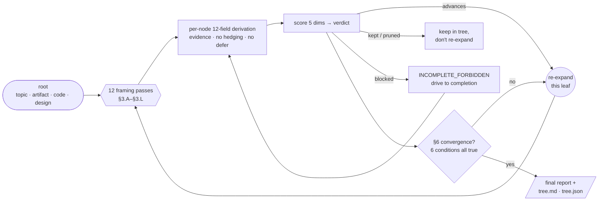

# cc-tree

[](https://github.com/skymanbp/cc-tree/actions/workflows/ci.yml)
[](https://github.com/skymanbp/cc-tree/releases)
[](LICENSE)

[](https://github.com/skymanbp/cc-tree/stargazers)

> Language: English (canonical). Chinese: [`README.zh.md`](README.zh.md).

A Claude Code plugin: **one universal radial-tree exploration engine, four
swappable presets**. Use it for divergent ideation, adversarial critique,
design-space exploration, or code audit — same engine, different vocabulary.
English is the default output and machine-schema language; roots, evidence,
quoted sources, and custom content may use any language, while `--lang`
selects the run's human-readable output language.

```bash
claude plugin marketplace add skymanbp/cc-tree
claude plugin install cc-tree@cc-tree
```

> Refactor of [`sci-paper`](https://github.com/skymanbp/sci-paper)'s
> `brainstorm` + `paper-attack-tree` skills, stripped of paper-specific
> anchors and parameterized via presets.

## The idea — a phylogenetic tree of thoughts

cc-tree treats *any* open-ended thinking task as a **phylogenetic tree
growing outward from one root**. The root is your input (a topic, a
document, a code path, a design prompt). Every node is expanded by the
**same 12 framing passes**, each child is fully derived and scored, and
only the high-value (`advances`) leaves get re-expanded — until the tree
reaches **substantive convergence**, not an arbitrary count.

![cc-tree as a radial "phylogenetic tree of thoughts": one ROOT at the
centre, depth as concentric rings growing outward, four coloured "clades"
for the four presets (brainstorm / attack / design / code-audit). There is
no single winner — a branch can succeed ("advances"), hit a dead end
("pruned" / "blocked"), or keep branching and be judged again, so several
wins appear at different depths and the branches reach uneven length. Each
terminal leaf carries a verdict marker — advances, kept, pruned, or blocked
— and the total leaf count is the width.](docs/assets/cc-tree-radial-tree.svg)

<sub>Inspired by the radial <em>tree of life</em>. The vocabulary the rest
of this README uses is all in this one picture: <strong>root</strong> (the
input at the centre — topic · artifact · code · design), <strong>node</strong>
(one idea / critique / option / finding, each with the same 12-field
derivation), <strong>depth</strong> (the concentric framing-recursion rings;
branches stop at different rings because only <code>advances</code> leaves
re-expand), <strong>width</strong> (the total number of terminal leaves /
tips, wherever they land — set by convergence, not a hand-picked cap), and
<strong>n</strong> (total nodes in the tree). Diagram source:
<a href="tools/gen_radial_tree.py"><code>tools/gen_radial_tree.py</code></a>.</sub>

```
  the tree grows OUTWARD from one root. a branch can WIN, hit a DEAD END, or
  keep BRANCHING and be judged again — no single winner, wins at any depth:

    ROOT ──┬── pruned                      (dead end at depth 1)
           ├── advances                    (a win at depth 1)
           └── advances ──┬── pruned        (this branch keeps going…)
                          └── advances ──┬── advances   (…a deeper win)
                                         └── blocked

  each node → 12 framings (§3.A–§3.L) → 12-field derivation → score → verdict;
  branches that keep advancing grow deeper; pruned / blocked ones stop.
```

The per-node loop, precisely:



Two properties make this more than "brainstorm in a loop": **(1)** every
leaf is fully derived with `file:line` / URL evidence — a hard ban on
`defer / future-work / TODO / NEEDS-MORE-INFO` leaves (§0.5); **(2)**
termination is *substantive convergence* (six simultaneous conditions),
never "ran out of patience".

## What it ships

### 1 skill

| Skill | What it does |
|---|---|
| `/cc-tree:tree` | Universal radial-tree engine. Loads a preset, builds the §2 baseline, then recursively applies 12 framing passes per node until **stable convergence** (no new high-verdict branches over the last 2 rounds + all 12 framings exercised + all leaves complete). Width × depth default to ∞; resource caps are opt-in. Hard ban on `defer / future-work / TODO / NEEDS-MORE-INFO` leaves. |

### 4 presets (`presets/<name>.md`)

| Preset | Use when | Verdict vocabulary (advances / kept / pruned / blocked) |
|---|---|---|
| `brainstorm` | Divergent ideation; surface unexplored research directions or exhaustive problem-solving paths | `PROMISING / MARGINAL / DEAD-END / NEEDS-MORE-INFO` |
| `attack` | Adversarial critique of a finished artifact (document, argument, design proposal); surface the most damaging reviewer-style attacks | `CONFIRMED / MARGINAL / REFUTED / INCOMPLETE_FORBIDDEN` |
| `design` | Design-space exploration; want an option × trade-off × reversibility table for a decision | `RECOMMENDED / VIABLE / NOT-RECOMMENDED / NEEDS-MORE-INFO` |
| `code-audit` | Code-flavored adversarial review (security / perf / contract / API-misuse / data-leak) | `CONFIRMED / MARGINAL / REFUTED / INCOMPLETE_FORBIDDEN` |

### 5 ergonomic slash-commands (`commands/<name>.md`)

`/cc-tree:brainstorm <topic>` ≡ `/cc-tree:tree <topic> --preset brainstorm`
(and likewise `:attack`, `:design`, `:code-audit`). Shorter to type; same
engine underneath. Plus `/cc-tree:tree-chain` for running several presets
in sequence (see **Cross-preset chaining** below).

### Engine spec & docs

The skill itself is ~250 lines of navigation; the full engine is in
[`docs/ENGINE.md`](docs/ENGINE.md) (中文平行版：[`docs/ENGINE.zh.md`](docs/ENGINE.zh.md)).
See also:

- [`docs/framings.md`](docs/framings.md) — the 12 framings with per-preset
  examples (中文：[`docs/framings.zh.md`](docs/framings.zh.md))
- [`docs/presets.md`](docs/presets.md) — how to author your own preset
  (中文：[`docs/presets.zh.md`](docs/presets.zh.md); schema is CI-enforced by
  `tools/validate_plugin.py`)
- [`docs/chaining.md`](docs/chaining.md) — cross-preset chaining contract
  (中文：[`docs/chaining.zh.md`](docs/chaining.zh.md))
- [`field-profiles/README.md`](field-profiles/README.md) — domain-aware
  reviewer weighting via `--field` (中文：
  [`field-profiles/README.zh.md`](field-profiles/README.zh.md))
- [`examples/attack/README.md`](examples/attack/README.md) — attack-preset
  example guide (中文：
  [`examples/attack/README.zh.md`](examples/attack/README.zh.md))

## Language contract

English is canonical for documentation and is the default output language.
Use `--lang <tag>` for an explicit BCP-47-like output tag (`en`, `zh`,
`zh-Hans`, `zh-Hant`, `fr-CA`, …), or `--lang auto` to detect the dominant
natural language of the primary invocation/root content. Mixed,
unrecognized, path-only, and code-only auto inputs fall back to `en`.
`zh` denotes the maintained Simplified Chinese convention; request
Traditional Chinese explicitly with `zh-Hant`.

The run keeps one language from start through resume and chaining. Human prose
(node statements, derivations, evidence explanations, warnings, and report
narrative) uses the resolved language. Machine identifiers remain English:
commands and flags, frontmatter and JSON keys, `root_kind` values, verdict
roles/labels, score keys, `node_schema` fields, framing IDs, status/tag tokens,
filenames, paths, code, equations, and API identifiers. Input roots, artifacts,
comments, glossaries, field-profile bodies, custom-preset prose, citations, and
quoted evidence may use any language; quotations stay verbatim and receive a
localized explanation when needed. See [`docs/ENGINE.md`](docs/ENGINE.md) §1.0
for the binding resolution and resume rules.

Documentation versioning follows [`docs/languages.json`](docs/languages.json):
unsuffixed `X.md` files are canonical English, `X.zh.md` files are maintained
Chinese parallels, and source digests make stale translations fail CI.

## Install

cc-tree is a self-contained directory marketplace. Install it with the
Claude Code plugin CLI:

```bash
# 1. Register this repo as a marketplace (directory source)
claude plugin marketplace add <path-to-this-repo>

# 2. Install the plugin from it
claude plugin install cc-tree@cc-tree

# (optional) sanity-check the manifests before/after
claude plugin validate <path-to-this-repo>
claude plugin list
```

Restart your Claude Code session to load the plugin (new plugins are
loaded at session start). Skills then appear namespaced: `/cc-tree:tree`,
`/cc-tree:brainstorm`, etc. To pick up later edits, run
`claude plugin update cc-tree` and restart.

## Quick start

```bash
# Divergent ideation
/cc-tree:brainstorm "ways to detect dark-matter substructure with weak lensing"

# Adversarial critique of a finished doc
/cc-tree:attack ./paper.tex

# Design-space exploration
/cc-tree:design "auth flow for our internal admin tool"

# Code audit
/cc-tree:code-audit ./src/api/upload.py

# Use the engine directly with an explicit preset
/cc-tree:tree <root> --preset brainstorm
/cc-tree:tree <file> --preset ./my-custom-preset.md

# Domain-aware reviewer weighting (physics ships built-in; author other
# fields from field-profiles/_template.md)
/cc-tree:attack ./paper.tex --field physics

# Explicit Chinese human-readable output; machine keys/statuses stay English
/cc-tree:attack ./paper.tex --lang zh

# Detect the dominant natural language of the root; ambiguous inputs fall back to en
/cc-tree:brainstorm "如何验证弱引力透镜中的暗物质子结构" --lang auto
```

Each run writes incrementally to `<out>/<UTCdate>__<slug>/` (default
`tree-out/...`; per-preset commands default to `brainstorm-out/`,
`attack-out/`, etc.). The output is a `tree.md` + `tree.json` + a
preset-determined final report (`shortlist.md` for brainstorm,
`confirmed.md` for attack, etc.).

## Cross-preset chaining

A natural workflow pipes one preset's best output into the next:
**brainstorm** → pick top-K → **design** each → **attack** the winner.

```bash
/cc-tree:tree-chain "ways to cut our API p99 latency" \
    --stages brainstorm,design,attack --top-k 3
```

Each stage converges independently; the top-K handoff between stages is
always logged (never silently truncated). Contract:
[`docs/chaining.md`](docs/chaining.md). The substrate is the universal
`--seed-from <primary.md>` flag (alias `--from-prior`), which seeds a run
from a prior run's deliverable.

## Why?

|  | ad-hoc "brainstorm with me" | cc-tree |
|---|---|---|
| **Coverage** | the 3 obvious angles | 12 fixed framings per node, incl. contrarian / inversion / high-risk |
| **Completeness** | "we could look at X later" | hard ban on `defer / TODO / future-work` leaves — every leaf derived with `file:line` / URL evidence |
| **When it stops** | when the chat trails off | substantive convergence (6 conditions), not a node count |
| **Output** | a chat log | `tree.md` + `tree.json` + a structured per-preset report |
| **Reuse** | re-prompt from scratch each time | one engine, 4 presets, chainable (`brainstorm → design → attack`) |

Two reasons, in prose.

**Reason 1: the structure repeats.** Brainstorming, adversarial review,
design exploration, and code audit all share the same skeleton —
*generate candidates from N framings → derive each one completely →
score → recurse on the high-value branches → terminate on stable
convergence, not on running out of patience*. Coding that skeleton once
and parameterizing the rest beats writing four near-duplicate skills.

**Reason 2: the failure modes repeat too.** Every divergent task LLMs
do has the same lazy-equilibrium attractors: defer to future-work,
generate near-duplicate branches with synonym swapping, skip the
high-risk/contrarian framings, declare convergence at the first slow
round. The engine encodes hard bans on all of these (§0 forbidden
patterns), and they apply equally well to brainstorming a research
direction and to auditing a Python file.

See [`EVALUATION.md`](EVALUATION.md) for the full design rationale.

## Relationship to sci-paper

[`skymanbp/sci-paper`](https://github.com/skymanbp/sci-paper) was the
original home of this engine, scoped to scientific paper writing /
review. cc-tree is the domain-agnostic extraction; sci-paper keeps its
paper-specific versions independent (no coupling). If you write papers,
use sci-paper. If you want the engine for anything else, use cc-tree.

## License

[MIT](LICENSE). The code, skills, presets, commands, and docs in this
repository are MIT-licensed. The `tree-out/` / `brainstorm-out/` /
`attack-out/` / `design-out/` / `code-audit-out/` directories are
user-generated and `.gitignore`-d by default.
