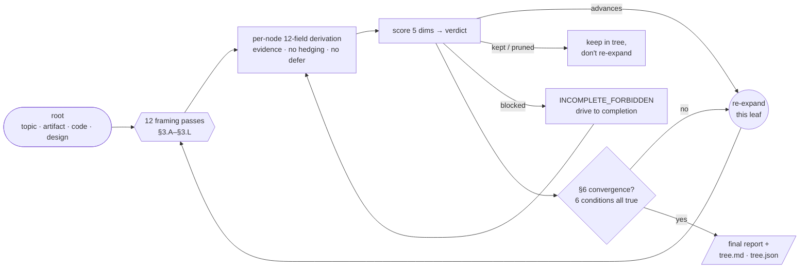
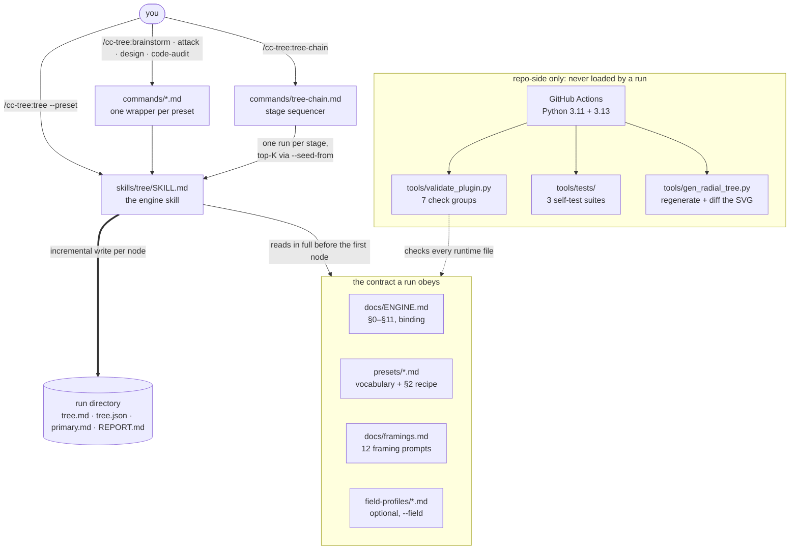

# cc-tree

[](https://github.com/skymanbp/cc-tree/actions/workflows/ci.yml)
[](https://github.com/skymanbp/cc-tree/releases)
[](LICENSE)

[](https://github.com/skymanbp/cc-tree/stargazers)

> Language: English (canonical). Chinese: [`README.zh.md`](README.zh.md).

**cc-tree is a Claude Code plugin that turns open-ended thinking into a tree you can audit.**
One exploration engine, four presets — brainstorm, adversarial critique, design-space exploration,
code audit. Every node is fully derived with `file:line` or URL evidence, deferred leaves
(`defer / future-work / TODO / NEEDS-MORE-INFO`) are banned, and a run stops on substantive
convergence rather than on a node budget.

```bash
claude plugin marketplace add skymanbp/cc-tree
claude plugin install cc-tree@cc-tree
```

## 1 · The problem, and what cc-tree does about it

### 1.1 The problem it targets

Ask an LLM to *brainstorm*, *review this critically*, *compare these designs* or *audit this file*,
and the same five failure modes come back:

| Failure mode | What it looks like |
|---|---|
| **Shallow coverage** | the three most obvious angles, then a summary |
| **Deferred leaves** | "promising, needs a deeper survey — future work" |
| **Pseudo-divergence** | six branches that are one branch with the nouns swapped |
| **Convenient convergence** | "that about covers it", just as new ideas get expensive |
| **Unverifiable output** | a chat log: nothing cites a line, nothing survives the scroll-back |

cc-tree inverts each row: fixed-breadth coverage, no deferrals, merged duplicates, a convergence
test you can check, and a `file:line` or URL behind every claim.

### 1.2 What it does — five capabilities

| # | Capability | Invoke | Deliverable |
|---|---|---|---|
| **1** | **Divergent exploration** — research directions or solution paths, grown until no new high-value branch appears | `/cc-tree:brainstorm` | `shortlist.md` |
| **2** | **Adversarial critique** of a document, argument or proposal; every leaf is `CONFIRMED` / `MARGINAL` / `REFUTED`, with the defense the artifact already mounts | `/cc-tree:attack` | `confirmed.md` |
| **3** | **Design-space exploration** — options × trade-offs × reversibility × cost, ending in a `RECOMMENDED` short-list | `/cc-tree:design` | `options.md` |
| **4** | **Code audit** — threat-model, contract and cross-file bugs a linter cannot see, each with `file:line` and a fix | `/cc-tree:code-audit` | `findings.md` |
| **5** | **Chaining** — brainstorm → design → attack, top-K piped between stages | `/cc-tree:tree-chain` | per stage + handoff log |

All five are the same engine; a preset changes the vocabulary, never the loop
([`docs/ENGINE.md`](docs/ENGINE.md) §10).

### 1.3 Working scope — what cc-tree is not

- **Not a one-shot tool or a chat.** A run is recursive and takes minutes to hours; after the §2.0
  glossary grill it runs to convergence without asking (§F6). You steer with flags.
- **Not a substitute for a domain expert, and not bundled with a model.** It is prompt engineering
  on your Claude Code model setting; a human decides which leaves to act on.
- **Not a linter.** `code-audit` targets what static analysis structurally cannot.

## 2 · How it works

### 2.1 The shape — one root, growing outward

A run is a tree grown outward from one root — your input. Every expansion tries all 12 framings,
so a node that grows gets one child per framing; each child is derived and scored, and only
`advances` children are expanded again, so branches stop at different depths. The run ends on §6
convergence.


<sub><strong>root</strong> is the input; a <strong>node</strong> is one idea, critique, option or
finding; <strong>depth</strong> is the ring a node sits on; <strong>width</strong> counts the
terminal tips, never a <code>blocked</code> one (§0.1); <strong>n</strong> counts every node. The
picture is one run of one preset — the four presets differ only in the verdict words of the table
beneath the tree (§5.2). Source:
<a href="tools/gen_radial_tree.py"><code>tools/gen_radial_tree.py</code></a>, which refuses to
draw a tree the engine could not produce.</sub>

### 2.2 The five irreducible steps

All five are specified in [`docs/ENGINE.md`](docs/ENGINE.md) and binding on every preset.


```mermaid
flowchart LR
    R([root<br/>topic · artifact · code · design]) --> F{{12 framing passes<br/>§3.A–§3.L}}
    F --> D[per-node 12-field derivation<br/>evidence · no hedging · no defer]
    D --> S[score 5 dims → verdict]
    S -->|advances| RE((re-expand<br/>this leaf))
    RE --> F
    S -->|kept / pruned| K[keep in tree,<br/>don't re-expand]
    S -->|blocked| B[INCOMPLETE_FORBIDDEN<br/>drive to completion]
    B --> D
    S --> C{§6 convergence?<br/>6 conditions all true}
    C -->|no| RE
    C -->|yes| OUT[/final report +<br/>tree.md · tree.json/]
```

1. **Ground the root (§2).** The preset's recipe builds it, every field cited; an optional glossary
   grill (§2.0) pins your project's terms first.
2. **Expand through 12 framings (§3).** First-principles, inversion, cross-disciplinary, red team,
   constraint variation, scale, substitution, office-hours 6Q, contrarian, failure-driven,
   high-risk asymmetric, and a meta self-audit — fixed, so the uncomfortable angles cannot be
   skipped. A §3.X web cross-check runs per node unless `--no-online`. Prompts:
   [`docs/framings.md`](docs/framings.md).
3. **Derive every child in 12 fields (§4).** A blank, hedged or deferred field makes the node
   `INCOMPLETE_FORBIDDEN`, which blocks termination until it is completed.
4. **Score and decide (§5).** Five dimensions, 0–3 each: `≥ 11` → `advances` (re-expanded),
   `8–10` → `kept`, `≤ 7` → `pruned`, unverified → `blocked`. Siblings at cosine ≥ 0.85 merge.
5. **Stop only on convergence (§6).** Six conditions at once: nothing incomplete, the `advances`
   ratio below `--min-novelty-ratio`, all 12 framings fired, every `advances` leaf re-expanded to
   exhaustion, a §3.K high-risk branch present, no cap tripped. A tripped cap is reported as
   `WIDTH_CAP_REACHED` / `DEPTH_CAP_REACHED` / `ROUNDS_EXHAUSTED`, never as `CONVERGED`.

### 2.3 The eight quality gates

Violating any of these invalidates the round (§0.5); each kills a failure mode from §1.1.

| Gate | Bans | Kills |
|---|---|---|
| §F1 | memory-cited claims — verify in the same turn | unverifiable output |
| §F2 | synonym-swapped siblings — merged | pseudo-divergence |
| §F3 | "obvious" / "details omitted" derivations | shallow coverage |
| §F4 | a framing pass without one fully derived high-risk branch | shallow coverage |
| §F5 | "out of ideas" passed off as convergence | convenient convergence |
| §F6 | mid-run prompting | convenient convergence |
| §F7 | the engine narrowing its own caps | convenient convergence |
| §F8 | `defer / future work / TODO / 待定 / NEEDS-MORE-INFO` leaves | deferred leaves |

Why one engine with presets rather than four skills, why 12 framings, and how this differs from
academic Tree-of-Thoughts: [`docs/EVALUATION.md`](docs/EVALUATION.md).

## 3 · What a run actually produces

From this repository's showcase fixture, [`examples/attack/`](examples/attack/README.md) — a real
capped run (`--width 3 --depth 1 --no-online --no-grill`), trimmed to the `CONFIRMED` leaves:

```
BEFORE — examples/attack/sample-claim.md
  3. Therefore the API is 10× faster for all users in production.
  4. The cache never returns stale data, because entries expire after 60 seconds.
  5. We tested with one concurrent user and saw no errors, so the cache is production-ready.

AFTER  — /cc-tree:attack ./sample-claim.md  →  confirmed.md, 3 findings
  C1  §3.F scale extrapolation  score 13  "10× for all users" generalizes a p50
                                          measured on one dev laptop
  C2  §3.A first-principles     score 12  "never stale" is refuted by the 60 s TTL
                                          in the same sentence
  C3  §3.D red team             score 11  "production-ready" rests on a
                                          single-concurrent-user test
```

Each finding in [`confirmed.md`](examples/attack/expected-out/confirmed.md) carries the quoted
position, the evidence, the artifact's own defense (`artifact_defense` — the engine must look for
the rebuttal before a finding can score high) and a fix; every node's 12 fields are in
[`tree.md`](examples/attack/expected-out/tree.md).

A run writes to its `--out` directory — by default `tree-out/`, `<preset>-out/` for a preset
command or `chain-out/` for a chain, each with a `<UTCdate>__<slug>/` segment, all `.gitignore`-d:

```
<out>/
├── tree.md              # every node; the human view
├── tree.json            # every node; the source of truth
├── glossary-anchors.md  # §2.0 prelude output (unless --no-grill)
├── <primary>.md         # shortlist.md / confirmed.md / options.md / findings.md
├── <secondary>.md*      # marginal.md / refuted.md / pending.md / …
├── REPORT.md            # §7.4 final report (also echoed to the terminal)
└── nodes/<id>.md        # spilled when a node's evidence exceeds 100 lines
```

Every node is written the moment its 12 fields are filled (§7.1); re-invoke with the same `--out`
and the run resumes from the last completed node.

## 4 · Verification

cc-tree ships no latency or accuracy benchmark: answer quality belongs to your model. What it
measures is whether the engine spec, the runtime prompt, the presets, the commands, the examples
and both documentation languages still agree — with checks that are themselves tested to fail.

`tools/validate_plugin.py` runs seven check groups (manifests, skills, presets, commands, tools,
cross-refs, i18n), backed by three self-test suites and a step that regenerates the diagram and
diffs it. CI runs these five steps, in this order, on Python 3.11 and 3.13 for every pull request
and push to `main`. Snapshot at HEAD, 2026-10-02; the counts move with the corpus and are reported,
never asserted:

```
$ python tools/validate_plugin.py
  [ok] manifests OK (version 0.7.4, metadata paired, changelog present)
  [ok] skills OK (1 skills)
  [ok] presets OK (4 presets, frontmatter schema)
  [ok] commands OK (5 commands, 4 preset wrappers)
  [ok] tools/**/*.py syntax OK (8 files)
  [ok] cross-refs OK (225 links / 13 anchors, 9 example citations, 47 command flags, 1 field profiles, 395 section refs)
  [ok] i18n OK (8 pairs, 23 canonical-only docs, 146 aligned sections, 492 machine-token checks)
validate_plugin: all checks passed

$ python tools/tests/test_validate.py
test_validate: all schema tests passed (4 shipped presets + 7 positive + 24 negative + 20 parser cases)

$ python tools/tests/test_i18n.py
test_i18n: all 43 multilingual cases passed

$ python tools/tests/test_checks.py
test_checks: all check-group tests passed (8 clean + 43 rejection cases)

$ cp docs/assets/cc-tree-radial-tree.svg /tmp/committed.svg
$ python tools/gen_radial_tree.py
wrote <repo>/docs/assets/cc-tree-radial-tree.svg
tips = 45 width = 45 n = 49 max depth = 3
$ diff -u /tmp/committed.svg docs/assets/cc-tree-radial-tree.svg
```

An empty `diff` is the pass; `<repo>` stands for the checkout root. Six whole-corpus adversarial
sweeps (v0.3.0 through v0.7.3) turned each class of drift they found into a CI failure; their
methods and their confirmed and rejected counts are recorded per release in
[`CHANGELOG.md`](CHANGELOG.md).

## 5 · Install and quick start

```bash
claude plugin marketplace add skymanbp/cc-tree
claude plugin install cc-tree@cc-tree
claude plugin validate <path-to-this-repo>   # optional
```

Restart Claude Code to load it; `claude plugin update cc-tree` picks up later releases.

```bash
/cc-tree:brainstorm "ways to detect dark-matter substructure with weak lensing"
/cc-tree:attack ./paper.tex --field physics --lang zh
/cc-tree:design "auth flow for our internal admin tool"
/cc-tree:code-audit ./src/api/upload.py
/cc-tree:tree <root> --preset ./my-custom-preset.md
/cc-tree:brainstorm "topic" --width 20 --depth 2 --no-online   # a capped taste, not convergence
```

## 6 · Reference

### 6.1 Presets — 4 shipped, unlimited custom

| Preset | Use when | Root | Verdicts (advances / kept / pruned / blocked) | Deliverable |
|---|---|---|---|---|
| `brainstorm` | divergent ideation | topic | `PROMISING / MARGINAL / DEAD-END / NEEDS-MORE-INFO` | `shortlist.md` |
| `attack` | critique of a finished artifact | artifact | `CONFIRMED / MARGINAL / REFUTED / INCOMPLETE_FORBIDDEN` | `confirmed.md` |
| `design` | option × trade-off × reversibility | design-prompt | `RECOMMENDED / VIABLE / NOT-RECOMMENDED / NEEDS-MORE-INFO` | `options.md` |
| `code-audit` | security / perf / correctness / contract review | code | `CONFIRMED / MARGINAL / REFUTED / INCOMPLETE_FORBIDDEN` | `findings.md` |

A custom preset is one `.md` file with a CI-checked frontmatter schema:
[`docs/presets.md`](docs/presets.md). No preset may weaken a universal rule (§10).

### 6.2 Commands

| Command | Equivalent to |
|---|---|
| `/cc-tree:tree <root> --preset <name\|path>` | the engine; the only command that takes a custom preset path |
| `/cc-tree:brainstorm <topic>` | `/cc-tree:tree <topic> --preset brainstorm` |
| `/cc-tree:attack <file>` | `/cc-tree:tree <file> --preset attack` (adds `--focus`) |
| `/cc-tree:design <prompt\|file>` | `/cc-tree:tree <prompt> --preset design` |
| `/cc-tree:code-audit <path>` | `/cc-tree:tree <path> --preset code-audit` |
| `/cc-tree:tree-chain <root> --stages …` | several presets in sequence, top-K piped between stages |

### 6.3 Flags

The authoritative table is in [`skills/tree/SKILL.md`](skills/tree/SKILL.md).

| Flag | Default | Meaning |
|---|---|---|
| `--preset <name\|path>` | *required* | a shipped preset or a path to your own |
| `--lang <tag\|auto>` | `en` | language of the prose; machine tokens stay English |
| `--width N` / `--depth N` / `--rounds N` | ∞ / ∞ / `conv` | caps; a tripped cap is reported, never called convergence |
| `--max-branches N` | ∞ | new branches per node per round; floor 12 |
| `--out <dir>` | per-command | the run directory |
| `--glossary <path>` | preset-determined | term sheet for the §2.0 grill |
| `--field <name\|path>` | none | field profile for domain weighting |
| `--seed-from <primary.md>` | none | seed depth 1 from a prior run (alias `--from-prior`) |
| `--no-grill` / `--no-online` | off | skip the §2.0 grill / web cross-checks |
| `--min-frameworks N` | 12 | framings per node; floor 12 |
| `--min-novelty-ratio R` | 0.15 | the §6.1 `advances`-ratio threshold |

`tree-chain` adds `--stages <a,b,c>` (default `brainstorm,design,attack`) and `--top-k N` (default 3).

### 6.4 Field profiles, chaining, languages

- **Field profiles.** `--field <name|path>` loads four short lists — reviewer concerns, field
  consensuses, failure modes, evidence bar — that reorder which branches are explored first and
  raise the citation bar (§2.2). `physics` ships; write others from
  [`field-profiles/_template.md`](field-profiles/_template.md).
- **Chaining.** `/cc-tree:tree-chain "…" --stages brainstorm,design,attack --top-k 3` runs each
  stage to convergence and logs every top-K handoff; `--seed-from` does the same by hand.
  Contract: [`docs/chaining.md`](docs/chaining.md).
- **Languages.** `--lang` localizes the prose (`auto` detects the root's language, falling back to
  `en`); flags, keys, verdict labels, statuses, filenames and paths stay English (§1.0). The docs
  follow the same rule: `X.md` is canonical, `X.zh.md` its Chinese parallel, and a translation
  whose English source changed fails CI.

## 7 · Design decisions

cc-tree is a prompt-engineering artifact: the runtime is Markdown, and the Python (standard library
only, never loaded by a run) exists to keep that Markdown honest. The full arguments are in
[`docs/EVALUATION.md`](docs/EVALUATION.md).

- **One engine + swappable presets**, not four near-duplicate skills or one `--mode` mega-skill.
- **Caps default to ∞**, so success cannot be declared at an arbitrary count.
- **Deferred leaves are banned**: a branch is driven to evaluability now, or re-routed (§3.E).
- **Incremental write**: the tree survives a kill, a context overflow or `^C`.
- **English-canonical machine skeleton**: prose localizes, identifiers do not.
- **Structural validation, not semantic**: CI checks that the corpus agrees with itself; whether a
  rubric is *good* stays a human judgment.

## 8 · Repository map and documentation index

### 8.1 Architecture

The runtime is Markdown that Claude Code loads when you type a command; the verification side is
Python that only CI and contributors run.


```mermaid
flowchart TB
    U(["you"])
    U -->|"/cc-tree:brainstorm · attack · design · code-audit"| CMD["commands/*.md<br/>one wrapper per preset"]
    U -->|"/cc-tree:tree --preset"| SK
    U -->|"/cc-tree:tree-chain"| CH["commands/tree-chain.md<br/>stage sequencer"]
    CMD --> SK["skills/tree/SKILL.md<br/>the engine skill"]
    CH -->|"one run per stage,<br/>top-K via --seed-from"| SK
    SK -->|"reads in full before the first node"| LOAD
    subgraph LOAD ["the contract a run obeys"]
        direction LR
        EN["docs/ENGINE.md<br/>§0–§11, binding"]
        PR["presets/*.md<br/>vocabulary + §2 recipe"]
        FR["docs/framings.md<br/>12 framing prompts"]
        FP["field-profiles/*.md<br/>optional, --field"]
    end
    SK ==>|"incremental write per node"| OUT[("run directory<br/>tree.md · tree.json · primary.md · REPORT.md")]
    subgraph VERIFY ["repo-side only: never loaded by a run"]
        direction LR
        CI["GitHub Actions<br/>Python 3.11 + 3.13"] --> VP["tools/validate_plugin.py<br/>7 check groups"]
        CI --> TS["tools/tests/<br/>3 self-test suites"]
        CI --> GEN["tools/gen_radial_tree.py<br/>regenerate + diff the SVG"]
    end
    VP -.->|"checks every runtime file"| LOAD
```

### 8.2 Documentation index

Start at [`docs/README.md`](docs/README.md) for the annotated index.

| Document | Read it when |
|---|---|
| [`docs/ENGINE.md`](docs/ENGINE.md) | you want the binding contract, §0–§11 |
| [`docs/framings.md`](docs/framings.md) | you want the 12 framing prompts |
| [`docs/presets.md`](docs/presets.md) | you are writing a preset |
| [`docs/chaining.md`](docs/chaining.md) | you are chaining presets |
| [`field-profiles/README.md`](field-profiles/README.md) | you are writing a field profile |
| [`examples/attack/README.md`](examples/attack/README.md) | you want real input and output |
| [`docs/EVALUATION.md`](docs/EVALUATION.md) | you want the design rationale |
| [`CONTRIBUTING.md`](CONTRIBUTING.md) | you are opening a pull request |
| [`CHANGELOG.md`](CHANGELOG.md) | you want the per-version history |

## 9 · Roadmap, limitations, and the rest

### 9.1 Roadmap

Open, undated: semantic validation of a scoring rubric (rationale in
[`docs/EVALUATION.md`](docs/EVALUATION.md)); more presets
([#1](https://github.com/skymanbp/cc-tree/issues/1)); more field profiles
([#2](https://github.com/skymanbp/cc-tree/issues/2)); a diagram export for `tree.json`
([#3](https://github.com/skymanbp/cc-tree/issues/3)); a gallery of real runs
([#4](https://github.com/skymanbp/cc-tree/issues/4)); long-run progress and resume reporting
([#5](https://github.com/skymanbp/cc-tree/issues/5)); more documentation languages.

### 9.2 Known limitations

- **No output benchmark** (§4): quality tracks your model; this repository measures its own
  consistency.
- **CI validates the repository, not a run.** In-run compliance rests on the §11 checklist and the
  §7.4 report's self-audit.
- **Unbounded by default.** An uncapped run on a rich root can take hours and many tokens; cap the
  first pass.
- **Translation freshness is enforced, quality is not.**
- **`--no-online` narrows the evidence** to local sources; the run stays valid.
- **Sub-agent fan-out buys wall-clock, not tokens**: the main agent re-verifies every citation a
  sub-agent returns (§8.1).

### 9.3 Relationship to sci-paper, contributing, license

cc-tree is the domain-agnostic extraction of the `brainstorm` + `paper-attack-tree` skills of
[`skymanbp/sci-paper`](https://github.com/skymanbp/sci-paper); the two evolve independently. Pull
requests are welcome — [`CONTRIBUTING.md`](CONTRIBUTING.md) lists the commands that reproduce CI and
the invariants first-time contributors trip on. [MIT](LICENSE); run-output directories are yours
and `.gitignore`-d.
