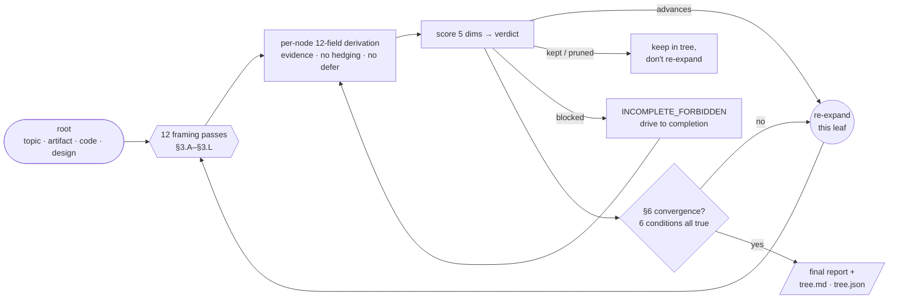

# cc-tree

[](https://github.com/skymanbp/cc-tree/actions/workflows/ci.yml)
[](https://github.com/skymanbp/cc-tree/releases)
[](LICENSE)

[](https://github.com/skymanbp/cc-tree/stargazers)

> 语言：中文。英文规范版：[`README.md`](README.md)。如有歧义，以英文版为准。
<!-- i18n-source-sha256: 5a4bfa2ad551615a1e72258cc84b780591f850ee055d156f92b06e1a3f49948b -->

**cc-tree 是一个 Claude Code 插件，它把开放式思考变成一棵可以被审计的树。**
一台通用的放射状树探索引擎，四个可替换的 preset：发散式头脑风暴、对抗式批评、设计空间探索、
代码审计 —— 同一台引擎，不同的词汇。它是一种有纪律的、落盘持久化的 tree-of-thoughts 搜索：
每个节点都必须带着 `file:line` 或 URL 证据被完整推导，
`defer / future-work / TODO / NEEDS-MORE-INFO` 式的叶子被硬性禁止，
运行的终止依据是实质性收敛，而不是耗尽某个节点预算。

```bash
claude plugin marketplace add skymanbp/cc-tree
claude plugin install cc-tree@cc-tree
```

> 由 [`sci-paper`](https://github.com/skymanbp/sci-paper) 的 `brainstorm` +
> `paper-attack-tree` 技能重构而来，剥离了论文特定的锚点，并通过 preset 参数化。

## 1 · 问题，以及 cc-tree 对它做了什么

### 1.1 它针对的问题

随便让哪个 LLM *头脑风暴一下*、*批判性地评审这个*、*对比这几个设计*、或者*审一下这个文件*，
回来的永远是同样的五种失效模式。它们不是模型的 bug，而是自由生成的偷懒平衡点。

| 失效模式 | 它在实践中长什么样 |
|---|---|
| **覆盖太浅** | 那三个最显而易见的角度，然后一段总结 |
| **推脱式叶子** | "有前景，但需要更深入的调研 —— 留待未来工作"：把非结果包装成结果 |
| **伪发散** | 六条分支，其实是同一条分支换了几个名词 |
| **省事式收敛** | "差不多就这些了" —— 恰好在新想法开始变贵的那一刻抵达 |
| **无法核验的产物** | 一段聊天记录：没有一句引到行号，翻上去就什么都不剩 |

目标效果就是逐行取反：**宽度固定的覆盖、零推脱、去重后的分支、一个你能自己复核的收敛判据，
以及每条断言都带着 `file:line` 或一个 URL。**

### 1.2 它能做什么 —— 五项能力

| # | 能力 | 调用 | 产出 |
|---|---|---|---|
| **1** | **穷尽式发散探索** —— 从一个主题向外生长研究方向或解题路径，直到不再出现高价值新分支为止，而不是聊到没话说为止 | `/cc-tree:brainstorm` | `shortlist.md` |
| **2** | **对成稿工件的对抗式批评** —— 审稿人式地攻击一份文档、论证或提案；每片叶子都要落到 `CONFIRMED` / `MARGINAL` / `REFUTED`，并附上它攻击的原文位置，以及工件自己已经摆出的辩护 | `/cc-tree:attack` | `confirmed.md` |
| **3** | **设计空间探索** —— 方案 × 取舍 × 可逆性 × 代价 × 与约束的契合度（fit-with-constraints），最后给出一张对照表和一份 `RECOMMENDED` 短名单 | `/cc-tree:design` | `options.md` |
| **4** | **代码审计** —— 静态 linter 在结构上就产不出的那类发现：依赖威胁模型的、契约层面的、跨文件推理的缺陷，每条都带 `file:line` 证据和一个修复建议 | `/cc-tree:code-audit` | `findings.md` |
| **5** | **把上面四项串起来** —— 把一个阶段的 top-K 产物喂给下一个：**brainstorm → design → attack**，先在方向上发散，再把最好的几条设计成方案，最后在你下注之前攻击赢家 | `/cc-tree:tree-chain` | 各阶段产物，外加交接日志 |

五项用的是*同一台引擎*。preset 换掉的是词汇，从来不是那个循环 ——
[`docs/ENGINE.md`](docs/ENGINE.md) 的 §10 就是精确的扩展面。

### 1.3 工作范围 —— cc-tree 不是什么

- **不是一次性的头脑风暴工具。** 引擎是递归的、以收敛终止的；一次真实运行要花几分钟到
  几小时。
- **不是聊天界面。** 一旦调用就跑到收敛，中途不再追问（§F6）。你通过下一次调用的 flag
  来操舵。
- **不能替代领域专家。** 它产出的是带引用的结构化探索；该行动哪些叶子，仍然由人来决定。
- **不捆绑任何模型。** 它是纯粹的提示词工程，跑在你现有的 Claude Code 模型设置之上。
- **不是 linter。** `code-audit` 找的正是静态分析器找不到的东西：依赖威胁模型的、
  契约层面的、跨文件推理的缺陷。

## 2 · 它是怎么运转的

### 2.1 形状 —— 一个根，向外生长

cc-tree 把*任何*开放式思考任务都当作**一棵从单一根向外生长的系统发生树**。根就是你的输入
—— 一个主题、一份文档、一条代码路径、一个设计提示。每个节点都由**同样的 12 个 framing
过程**展开，每个子节点被完整推导并打分，只有高价值（`advances`）的叶子才会被重新展开，
直到这棵树达到**实质性收敛**，而不是停在某个任意的数量上。

![cc-tree as a radial phylogenetic tree of thoughts: one ROOT at the centre, depth as concentric
rings growing outward, four coloured clades for the four presets (brainstorm / attack / design /
code-audit). There is no single winner — a branch can succeed (advances), hit a dead end (pruned /
blocked), or keep branching and be judged again, so several wins appear at different depths and the
branches reach uneven length. Each tip carries a verdict marker, and the width is the number of
terminal leaves — blocked tips are excluded until they are driven to completion, so this snapshot
is a run still in flight.](docs/assets/cc-tree-radial-tree.svg)

<sub>灵感来自放射状的<em>生命之树</em>。本文档后面用到的全部词汇都在这张图里：
<strong>root</strong>（中心的输入 —— 主题 · 工件 · 代码 · 设计）、<strong>node</strong>
（一个想法 / 批评 / 方案 / 发现，各自都有同样的 12 字段推导）、<strong>depth</strong>
（一圈圈的 framing 递归年轮；因为只有 <code>advances</code> 叶子会被重新展开，不同分支会停在
不同的圈层）、<strong>width</strong>（终端叶子的数量，无论它们落在哪一圈 —— 由收敛判据决定，
而不是手工挑一个上限；按 §0.1，<code>blocked</code> 树梢在被推进到完整之前一律不计入），
以及 <strong>n</strong>（树中节点总数）。图的源码：
<a href="tools/gen_radial_tree.py"><code>tools/gen_radial_tree.py</code></a>。</sub>

```
  the tree grows OUTWARD from one root. a branch can WIN, hit a DEAD END, or
  keep BRANCHING and be judged again — no single winner, wins at any depth:

    ROOT ──┬── pruned                      (dead end at depth 1)
           ├── advances                    (a win at depth 1)
           └── advances ──┬── pruned        (this branch keeps going…)
                          └── advances ──┬── advances   (…a deeper win)
                                         └── blocked

  each node → 12 framings (§3.A–§3.L) → 12-field derivation → score → verdict;
  branches that keep advancing grow deeper; pruned / blocked ones stop.
```

### 2.2 五个不可再分的步骤

五步全部写在 [`docs/ENGINE.md`](docs/ENGINE.md) 里，并且对每一个 preset 都有约束力。



#### 步骤 1 —— 把根锚定在真实证据上（§2）

recipe 由 preset 提供；引擎负责强制每一个根字段都带上 `file:line`、URL 或命令输出作为引用。
可选的术语拷问前奏（§2.0）会在生成任何一个分支之前，把根节点里的技术名词短语锁定到你项目的
术语表上，这样整棵树才不会花掉一百个叶子去解一个错的问题。

#### 步骤 2 —— 让每个节点走完 12 个 framing（§3）

每个节点 —— 先是根，然后是每一片 `advances` 叶子 —— 都要过一遍全部 12 个 framing，
每一个都必须至少产出一个子节点。这个集合是固定的，model 没法悄悄跳过那些让它不舒服的角度。

| Pass | 它强迫你做什么 |
|---|---|
| §3.A First-principles | 剥掉一条承重假设，看还剩下什么 |
| §3.B Inversion | 试试否定、对偶，以及它失效的边界 |
| §3.C Cross-disciplinary | 从至少 3 个其他领域移植工具 |
| §3.D Adversarial / red team | 找出杀伤力最大的 3 条反驳 |
| §3.E Constraint variation | 放松一条约束，收紧另一条 |
| §3.F Scale extrapolation | 1000× / 0.001× / 领域边界 |
| §3.G Substitution | 换掉一个组件，观察变化 |
| §3.H Office-hours 6Q | YC 式的需求真实性拷问 |
| §3.I Contrarian | 这里哪条主流共识可能是错的？ |
| §3.J Failure-driven | 把一个具体的当前失败变成下一个问题 |
| §3.K High-risk asymmetric | 强制至少 1 条低概率、范式级的分支 |
| §3.L Meta self-audit | 对模型自身盲区的 7 问自审 |

还有第十三个过程 §3.X，除非加了 `--no-online`，否则每个节点都要做一次外部交叉核查（先
`WebSearch`，再 `WebFetch` 真实页面）。完整提示词与每个 preset 的示例见
[`docs/framings.md`](docs/framings.md)。

#### 步骤 3 —— 把每个子节点推导成 12 个字段（§4）

每个子节点都要填进 preset 的 12 字段节点 schema —— 陈述、父 framing、位置、推导、假设、
预测、辩护、替代解读、修复/代价、外部核查、分支潜力、临时判决。空白、含糊或推脱的字段不会
产出一个"弱一点"的节点；它们产出的是一个 `INCOMPLETE_FORBIDDEN` 节点，**阻塞整轮终止**，
直到它被推进到完整为止。

#### 步骤 4 —— 打分，然后决定要不要递归（§5）

五个由 preset 声明的维度，每个取 0–3 的整数，加总上限 15。`score ≥ 11`（外加 preset 自己的
附加门槛）→ `advances`，这片叶子会被重新展开；`8–10` → `kept`；`≤ 7` → `pruned`；
任何被未经验证的断言主导的 → `blocked`。近似重复的兄弟节点在余弦相似度 ≥ 0.85 时合并
（§5.4），所以 width 代表的是覆盖度，不是复读。

#### 步骤 5 —— 只在实质性收敛时停下（§6）

六个条件必须**同时**成立：不存在未完成节点；最近两轮的 `advances` 比例已经跌到
`--min-novelty-ratio` 以下；12 个 framing 全部触发过；每一片 `advances` 叶子都被重新展开过
且再没长出新东西；至少存在一条被完整推导的 §3.K 高风险分支；并且没有任何用户上限被触发。
如果先撞到了上限，引擎会如实报告 `WIDTH_CAP_REACHED` / `DEPTH_CAP_REACHED` /
`ROUNDS_EXHAUSTED` —— 绝不谎称 `CONVERGED` —— 而且仍会先把所有在途叶子补完。

### 2.3 preset 不得削弱的引擎不变式

| 不变式 | 契约 |
|---|---|
| 每节点每轮 12 个 framing 过程 | §3.A–§3.L 外加 §3.X 外部交叉核查；`--min-frameworks` 的硬下限就是 12 |
| 每节点 12 字段推导 | §4，每个字段都必须非空、不含糊、并带引用 |
| 5 维打分 | §5.1，每维 0–3 整数，上限 15，映射到四角色判决（§5.2） |
| 兄弟节点合并 | §5.4，余弦相似度 ≥ 0.85；被合并的节点仍然可见，并打上 `MERGED_INTO=<id>` 标签 |
| 六条件收敛判据 | §6.1，配 §6.2 那张显式的终止决策表；上限只是逃生阀，从来不算成功 |
| 强制子代理并行 | §8.1，fan-out ≥ 5 时生效 —— 根节点必然满足，它的 12 个 framing 至少扇出 12 个子节点 —— 而且主代理要重新核对子代理返回的每一条引用，子节点才算数 |

### 2.4 八道质量关卡

违反其中任何一条都会让该轮作废（§0.5）。它们在每种输出语言里都按语义强制，而不是一份英文
短语黑名单；每一条都对应 1.1 节里的某一行。

| 关卡 | 禁止 | 它杀掉的失效模式 |
|---|---|---|
| §F1 | 凭记忆断言 —— 每条外部断言都必须在同一轮内被验证 | 无法核验的产物 |
| §F2 | 伪发散 —— 换词造出的兄弟节点算同一个分支，会被合并 | 伪发散 |
| §F3 | 跳过推导 —— 不许"显然"、不许"细节从略"；数字必须过一遍 `python` 自检 | 覆盖太浅 |
| §F4 | 规避风险 —— 每轮必须完整推导一条高风险分支，无论它最后是什么判决 | 覆盖太浅 |
| §F5 | 伪收敛 —— "我没新想法了"不等于 §6 收敛 | 省事式收敛 |
| §F6 | 中途追问 —— 根和 preset 一旦加载就全自动跑完 | 省事式收敛 |
| §F7 | 自行收窄上限 —— 引擎不得擅自调小 `--width` / `--depth` / `--rounds` | 省事式收敛 |
| §F8 | 推脱式叶子 —— `defer / future work / TODO / 待定 / NEEDS-MORE-INFO` 一律判 `INCOMPLETE_FORBIDDEN` | 推脱式叶子 |

### 2.5 它凭什么不一样

|  | 随口一句"陪我头脑风暴一下" | cc-tree |
|---|---|---|
| **覆盖度** | 那 3 个显而易见的角度 | 每个节点 12 个固定 framing，含反共识 / 反转 / 高风险 |
| **完整度** | "这个我们回头再看" | 硬禁 `defer / TODO / future-work` 叶子 —— 每片叶子都带 `file:line` / URL 证据 |
| **何时停** | 聊到没话说为止 | 实质性收敛（6 个条件），不是数够了几个节点 |
| **产物** | 一段聊天记录 | 落盘的 `tree.md` + `tree.json` + 按 preset 结构化的报告 |
| **抗崩溃** | 往上翻聊天记录，祈祷 | 每个节点即时写盘；重新调用即可续跑 |
| **复用** | 每次都从头重新提示 | 一台引擎、4 个 preset、可串联（`brainstorm → design → attack`） |

两条理由，用散文说。**理由 1：结构是重复的。** 头脑风暴、对抗式评审、设计探索、代码审计，
共享同一副骨架 —— *从 N 个 framing 生成候选 → 把每个都完整推导 → 打分 → 在高价值分支上递归
→ 在稳定收敛处终止，而不是在耐心耗尽处终止*。把这副骨架写一次、其余参数化，胜过写四个
近乎重复的技能。

**理由 2：失效模式也是重复的。** LLM 做的每一类发散任务，都有同样的偷懒平衡点：推给
future-work、用换词法造出近乎重复的分支、跳过高风险 / 反共识的 framing、在第一个变慢的
回合就宣布收敛。引擎对这些全部编码了硬禁令（§0.5 禁止模式，§F1–§F8），它们对"头脑风暴
一个研究方向"和"审一个 Python 文件"同样有效。

完整的设计理据 —— 包括为什么是 12 个 framing 而不是 7 个或 20 个，以及 cc-tree 与学术界的
Tree-of-Thoughts、与 agent 循环有何不同 —— 见 [`docs/EVALUATION.md`](docs/EVALUATION.md)。

## 3 · 一次运行到底产出什么

下面这个例子就是本仓库自己的展示样例 [`examples/attack/`](examples/attack/README.md) ——
一次真实的加上限运行（`--width 3 --depth 1 --no-online --no-grill`），手工裁剪到只剩根节点和
它的 `CONFIRMED` 叶子。真实运行还会带上 `MARGINAL` / `REFUTED` 分支，以及每节点完整的
12 字段推导。

### 3.1 之前 → 之后

```
BEFORE — examples/attack/sample-claim.md, five plausible-sounding lines
  3. Therefore the API is 10× faster for all users in production.
  4. The cache never returns stale data, because entries expire after 60 seconds.
  5. We tested with one concurrent user and saw no errors, so the cache is production-ready.

AFTER  — /cc-tree:attack ./sample-claim.md  →  confirmed.md, 3 findings
  C1  §3.F scale extrapolation  score 13  "10× for all users" generalizes a p50
                                          measured on one dev laptop
  C2  §3.A first-principles     score 12  "never stale" is refuted by the 60 s TTL
                                          in the same sentence
  C3  §3.D red team             score 11  "production-ready" rests on a
                                          single-concurrent-user test
```

注意是哪些 framing 抓到了什么：尺度外推抓到了"开发笔记本 → 生产环境"的跳跃，第一性原理抓到了
那句自我否定的话，red team 抓到了并发假设。三条里没有一条是自由式评审最先给出的那个*显然*的
反对意见 —— 而且没有一条是模型自己挑的，因为 framing 集合是固定的，十二个都必须试。

### 3.2 主产物长什么样

`confirmed.md` 才是你真正拿去行动的文件。每条发现都带上原文位置、证据、工件自己有没有辩护，
以及一个修复建议
（[`examples/attack/expected-out/confirmed.md`](examples/attack/expected-out/confirmed.md)）：

```markdown
## C2 — "never returns stale data" is contradicted by the 60 s TTL in the same sentence (S=3)

- **artifact_position**: ../sample-claim.md:7-8 —
  "never returns stale data, because entries expire after 60 seconds."
- **evidence**: A 60 s TTL *is* a staleness window — a row updated in the
  DB at t=0 is served from cache as stale until its entry expires (up to
  60 s later). "Never stale" and "expires after 60 s" are mutually
  exclusive: the justifying clause refutes the claim it justifies.
- **artifact_defense**: none — read all of lines 1-10; no write-through
  or invalidation-on-write mechanism is described that would close the
  window.
- **proposed_fix**: replace "never returns stale data" with "may serve
  data up to 60 s stale", or add write-through invalidation if true
  freshness is required.
```

`artifact_defense` 这个字段才是它和一条评审意见的分水岭：引擎必须主动去找工件*自己*的反驳，
并如实报告找到了什么，所以一条发现不可能仅仅因为审阅者读了一半就停下而拿到高分。带全部 12
字段和打分细目的节点视图在
[`examples/attack/expected-out/tree.md`](examples/attack/expected-out/tree.md)。

### 3.3 落到磁盘上的东西

每次运行都增量写入它的 `--out` 目录，而那个目录**就是**本次运行的目录 —— 你传进去的路径后面
不会再被追加任何东西。带日期的那一段只属于*默认值*：引擎是 `tree-out/<UTCdate>__<slug>/`，
按 preset 的命令分别是 `brainstorm-out/<UTCdate>__<slug>/`、`attack-out/…`、`design-out/…`、
`code-audit-out/…`，`tree-chain` 则是 `chain-out/…`。

```
<out>/
├── tree.md              # outline of every node; primary human view
├── tree.json            # full data for every node; machine source of truth
├── glossary-anchors.md  # §2.0 prelude output (unless --no-grill)
├── <primary>.md         # shortlist.md / confirmed.md / options.md / findings.md
├── <secondary>.md*      # marginal.md / refuted.md / pending.md / …
├── REPORT.md            # §7.4 final report (also echoed to the terminal)
└── nodes/
    └── <id>.md          # spilled when a node's evidence exceeds 100 lines
```

这些目录默认全部被 `.gitignore` 掉 —— 它们是你的内容，不是插件的。

### 3.4 抗崩溃与续跑

每个节点在它的 12 个字段填满的那一刻就落盘（§7.1）—— 不是攒到最后一起写。就算进程被杀、
上下文窗口被填满、或者你中途打断，磁盘上的树在最后一个完成节点之前都是自洽的。用同一个
`--out <dir>` 重新调用，引擎就会从 id 最大的叶子继续。

## 4 · 验证仪表盘

### 4.1 什么被测了，什么没有

cc-tree 不附带任何延迟或准确率基准，硬造一个也是不诚实的：运行时是一份由你 Claude Code
会话所设模型执行的提示词契约，所以耗时和回答质量是那个模型的属性，不是这个仓库的属性。
真正*可测*、也正是这块仪表盘所报告的，是**规范本身及其关卡的完整性**：引擎规范、运行时
提示词、四个 preset、命令、示例、以及两种文档语言，彼此是否仍然一致；以及那些负责断言这件事
的检查，自己会不会失败。

### 4.2 关卡覆盖

`tools/validate_plugin.py` 会在每一个 pull request、以及每一次推到 `main` 的 push 上跑七组
检查，覆盖 Python 3.11 与 3.13：

| 检查组 | 在什么情况下失败 |
|---|---|
| manifests | 插件与市场清单的版本或身份信息漂移 |
| skills | `SKILL.md` 没有 frontmatter，或它的 `name` 与所在目录不一致 |
| presets | 违反任何一条 preset schema 规则（§10–§11） |
| commands | 命令没有描述，或某个 preset 发布时没带它的外壳 |
| tools | 有 Python 文件无法解析 |
| cross-refs | 死锚点、解析不了的相对链接、越界的示例行号引用、未文档化的命令 flag、格式错误的 field profile、悬空的 `§N` 引用 |
| i18n | 未登记的文档、过期摘要、标题或围栏结构分叉、译文过薄或直接抄英文、丢失机器 token |

给它们兜底的是三套自测，外加一步 CI：重新生成放射状图并做 diff，这样已提交的 SVG 不可能
和 [`tools/gen_radial_tree.py`](tools/gen_radial_tree.py) 漂移开：

| 测试套 | 覆盖什么 |
|---|---|
| [`tools/tests/test_validate.py`](tools/tests/test_validate.py) | preset schema 校验器 + frontmatter 解析器，正例与反例 |
| [`tools/tests/test_i18n.py`](tools/tests/test_i18n.py) | 多语言契约：配对、摘要、结构一致性、反例 |
| [`tools/tests/test_checks.py`](tools/tests/test_checks.py) | 对一个合成仓库跑全部七组检查，每条规则做一次变异 |

在本地复现整道关卡 —— CI 跑的就是这些。下面是 v0.7.1 时的快照；逐次运行的计数会随语料变化，
所以它们只是被报告，从不被断言：

```
$ python tools/validate_plugin.py
  [ok] manifests OK (version 0.7.1, metadata paired, changelog present)
  [ok] skills OK (1 skills)
  [ok] presets OK (4 presets, frontmatter schema)
  [ok] commands OK (5 commands, 4 preset wrappers)
  [ok] tools/**/*.py syntax OK (7 files)
  [ok] cross-refs OK (210 links / 13 anchors, 9 example citations, 42 command flags, 1 field profiles, 404 section refs)
  [ok] i18n OK (8 pairs, 22 canonical-only docs, 8 digests, 152 aligned sections, 507 machine-token checks)
validate_plugin: all checks passed

$ python -m pytest tools/tests -q
22 passed
```

### 4.3 对抗式扫查记录

自 v0.3.0 起，每一个小版本都是由一次对全语料的对抗式扫查驱动的 —— 从 v0.6.0 开始由*另一个*
模型家族来做，并且加了一道独立的反驳过程，findings 要先被它筛过才允许动手。确认/否决的比例
是这个项目手上唯一诚实的度量，所以它被原样公布，而不是被抹平：

| 版本 | 方法 | findings | 它改变了什么 |
|---|---|---|---|
| v0.3.0 | 第一次逐行扫查 | 20 个文件里 26 条确认缺陷 | 5 项跨文件一致性检查变成了 CI 失败项 |
| v0.5.0 | 第二次扫查，逐行过完每一个发布文件 | 18 个文件里 24 条缺陷 | 悬空 `§N` 指针与位置放错的锚点变成了 CI 失败项 |
| v0.6.0 | 由第二个模型家族（`gpt-5.6-sol`，xhigh）做的 3 路只读评审 | 55 条编号 findings；其中 26 条在动手前由执行复现（26/26 确认） | 堵死了*关卡自身*的假通过通道 |
| v0.7.0 | 5 维多代理审计 + 独立反驳过程 | 32 条确认、6 条否决 | 修掉了那些"失败时反而放行"的检查 |
| v0.7.1 | 全语料文档审计 + 反驳过程 | 14 条确认、26 条否决 | 校验器函数覆盖率 18/35 → 35/35 |

有两行值得读第二遍。v0.7.1 里那套新的行为测试立刻找出了三个已发布仓库自身暴露不出来的缺陷：
删掉*每一个*命令外壳反而能通过外壳配对检查、`_check_command_flags` 忽略了它自己的入参、
以及 v0.7.0 自己那道零计数绊线会拒绝一个合法仓库。而在 v0.7.1 里，反驳过程推翻了一条维护者
本人已经判定为确认的 finding。逐版本细节见 [`CHANGELOG.md`](CHANGELOG.md)。

## 5 · 安装与快速上手

### 5.1 安装

cc-tree 是一个自包含的目录型 marketplace。用 Claude Code 的插件 CLI 安装：

```bash
# 1. Register this repo as a marketplace (directory or GitHub source)
claude plugin marketplace add skymanbp/cc-tree
# 2. Install the plugin from it
claude plugin install cc-tree@cc-tree
# (optional) sanity-check the manifests before/after
claude plugin validate <path-to-this-repo>
claude plugin list
```

重启 Claude Code 会话以加载插件（新插件在会话启动时加载）。技能随后会带命名空间出现：
`/cc-tree:tree`、`/cc-tree:brainstorm` 等。要让后续改动生效，运行
`claude plugin update cc-tree` 并重启。

### 5.2 快速上手

```bash
# Divergent ideation
/cc-tree:brainstorm "ways to detect dark-matter substructure with weak lensing"
# Adversarial critique of a finished doc
/cc-tree:attack ./paper.tex
# Design-space exploration
/cc-tree:design "auth flow for our internal admin tool"
# Code audit
/cc-tree:code-audit ./src/api/upload.py

# Use the engine directly with an explicit preset
/cc-tree:tree <root> --preset brainstorm
/cc-tree:tree <file> --preset ./my-custom-preset.md

# Domain-aware reviewer weighting (physics ships built-in; author other
# fields from field-profiles/_template.md)
/cc-tree:attack ./paper.tex --field physics
# Explicit Chinese human-readable output; machine keys/statuses stay English
/cc-tree:attack ./paper.tex --lang zh
# Detect the dominant natural language of the root; ambiguous inputs fall back to en
/cc-tree:brainstorm "如何验证弱引力透镜中的暗物质子结构" --lang auto
# Quick capped run when you want a taste rather than convergence
/cc-tree:brainstorm "topic" --width 20 --depth 2 --no-online
```

一个从输入到产物的完整实例见 [`examples/attack/`](examples/attack/README.md)。

## 6 · 参考

### 6.1 Preset —— 自带 4 个，自定义不限

每个 preset（[`presets/`](presets/)）提供词汇；谁都不能削弱通用规则（§10）。

| Preset | 什么时候用 | 根 | 判决（advances / kept / pruned / blocked） | 主产物 |
|---|---|---|---|---|
| `brainstorm` | 发散式构思；挖出没被探索过的研究方向或穷尽解题路径 | topic | `PROMISING / MARGINAL / DEAD-END / NEEDS-MORE-INFO` | `shortlist.md` |
| `attack` | 对成稿工件（文档、论证、提案）做对抗式批评 | artifact | `CONFIRMED / MARGINAL / REFUTED / INCOMPLETE_FORBIDDEN` | `confirmed.md` |
| `design` | 设计空间探索；想要一张方案 × 取舍 × 可逆性的对照表 | design-prompt | `RECOMMENDED / VIABLE / NOT-RECOMMENDED / NEEDS-MORE-INFO` | `options.md` |
| `code-audit` | 代码味的对抗式评审（安全 / 性能 / 正确性 / 契约） | code | `CONFIRMED / MARGINAL / REFUTED / INCOMPLETE_FORBIDDEN` | `findings.md` |

自己写一个只需要一份带规定 frontmatter schema 的 `.md` —— 见
[`docs/presets.md`](docs/presets.md)。这套 schema 是 CI 强制的，所以格式不对的 preset
在跑起来之前就会被拦下。

### 6.2 命令

| 命令 | 等价于 |
|---|---|
| `/cc-tree:tree <root> --preset <name\|path>` | 引擎本身；唯一接受自定义 preset 路径的命令 |
| `/cc-tree:brainstorm <topic>` | `/cc-tree:tree <topic> --preset brainstorm` |
| `/cc-tree:attack <file>` | `/cc-tree:tree <file> --preset attack` |
| `/cc-tree:design <prompt\|file>` | `/cc-tree:tree <prompt> --preset design` |
| `/cc-tree:code-audit <path>` | `/cc-tree:tree <path> --preset code-audit` |
| `/cc-tree:tree-chain <root> --stages …` | 多个 preset 依次跑，阶段之间传递 top-K |

这些外壳还会改掉默认输出目录（`brainstorm-out/`、`attack-out/` 等），并携带 preset 专属
flag，比如 `attack` 的 `--focus <section|claim|equation>`。

### 6.3 Flag

通用 flag 对每个 preset 都生效。带逐条语义的权威表格在
[`skills/tree/SKILL.md`](skills/tree/SKILL.md) 里。

| Flag | 默认 | 含义 |
|---|---|---|
| `--preset <name\|path>` | *必填* | `brainstorm` / `attack` / `design` / `code-audit`，或你自己的路径 |
| `--lang <tag\|auto>` | `en` | 本地化散文的输出语言；机器 token 保持英文 |
| `--width N` | ∞ | 最终叶子数上限 |
| `--depth N` | ∞ | 相对根的树深上限 |
| `--rounds N` | `conv` | 展开轮数上限；`conv` = 由 §6 收敛终止 |
| `--max-branches N` | ∞ | 每节点每轮的新分支上限；下限是 12 |
| `--out <dir>` | 按命令而定 | 输出目录 |
| `--glossary <path>` | 按 preset 而定 | §2.0 术语拷问用的术语表 |
| `--field <name\|path>` | 无 | 领域加权用的 field profile |
| `--seed-from <primary.md>` | 无 | 用上一轮的产物给 depth-1 播种（别名 `--from-prior`） |
| `--no-grill` | 关 | 跳过 §2.0 术语前奏 |
| `--no-online` | 关 | 禁用 `WebSearch` / `WebFetch` |
| `--min-frameworks N` | 12 | 每节点最少 framing 数；下限就是 12 |
| `--min-novelty-ratio R` | 0.15 | §6.1 收敛判据里 `advances` 比例的阈值 |

`tree-chain` 另有 `--stages <a,b,c>`（默认 `brainstorm,design,attack`）和 `--top-k N`
（默认 3）。preset 可以文档化自己的 flag，比如 `attack` 的
`--focus <section|claim|equation>`。

### 6.4 领域加权 —— field profile

`--field <name|path>` 会加载一份**领域视角档案**（[`field-profiles/`](field-profiles/)）：
四份简短清单 —— 审稿人关注点、领域共识、常见失效模式、证据门槛 —— 用来重新排定 12 个
framing 先探索哪些分支，并抬高引用标准（§2.2）。档案与 preset 无关：同一份档案能让 `attack`
审一篇论文更锋利，也能让 `brainstorm` 找研究方向、让 `code-audit` 审一份模拟代码更锋利。
插件自带一份物理档案（[`field-profiles/physics.md`](field-profiles/physics.md)）；其他领域从
[`field-profiles/_template.md`](field-profiles/_template.md) 开始写。档案找不到只会告警并继续
—— 加权是增强项，从来不是阻塞项。

### 6.5 跨 preset 串联

一条很自然的工作流是把一个 preset 最好的产物喂给下一个：**brainstorm** → 取 top-K →
逐个 **design** → 对赢家做 **attack**。

```bash
/cc-tree:tree-chain "ways to cut our API p99 latency" \
    --stages brainstorm,design,attack --top-k 3
```

每个阶段独立收敛；阶段之间的 top-K 交接一定会被记录，绝不静默截断。底层机制是通用的
`--seed-from <primary.md>` flag（别名 `--from-prior`），它用上一轮运行的产物给新一轮播种，
所以你也可以手工串。契约见 [`docs/chaining.md`](docs/chaining.md)。

### 6.6 双语输出与双语文档

`--lang <tag|auto>` 选择本次运行人类可读的输出语言（`en`、`zh`、`zh-Hans`、`zh-Hant`、
`fr-CA` 等）；`auto` 会检测根的主导自然语言，遇到混合、无法识别、纯路径、纯代码的输入则
回退到 `en`。**机器骨架在任何语言下都保持英文**：flag、frontmatter 与 JSON 键、`root_kind`
取值、判决标签、score key、`node_schema` 字段、framing ID、状态 token、文件名与路径。
根文本、工件、术语表、自定义 preset 的散文、引文与引述证据可以用任何语言，引述保持原文逐字
不动，只在旁边补一段本地化解释，而不是替换掉它。一次运行从开始到续跑、到串联全程只用一种
语言（§1.0）。

文档本身遵守同一条规则：不带后缀的 `X.md` 是规范英文版，`X.zh.md` 是持续维护的中文平行版，
登记在 [`docs/languages.json`](docs/languages.json) 中，每份译文都记录了英文源的 SHA-256
摘要，所以过期的译文会让 CI 失败。

### 6.7 可扩展性

| 你想加什么 | 就写 | 由谁校验 |
|---|---|---|
| 一种新的探索模式 | 一份带 frontmatter schema 的 preset `.md` | preset schema 检查 + 外壳配对检查 |
| 一个新的领域视角 | 一份带四个 `##` 小节的 field profile `.md` | field-profile schema 检查 |
| 一种更短的输入方式 | 一份 command `.md` 外壳 | command frontmatter + flag 文档化检查 |
| 一种新的文档语言 | 在 `docs/languages.json` 里加一条 `pairs` | 摘要、标题、代码围栏与机器 token 的一致性 |

## 7 · 技术栈、设计取舍与项目哲学

### 7.1 技术栈

刻意地几乎没有技术栈。cc-tree 是一个**提示词工程工件**，不是一个应用：运行时就是 Markdown，
而 Python 的存在只是为了让那些 Markdown 保持诚实。

| 层 | 是什么 | 运行时依赖 |
|---|---|---|
| 运行时 | Markdown —— 一个技能（[`skills/tree/SKILL.md`](skills/tree/SKILL.md)）、4 个 preset、5 个命令外壳、领域档案 | 除 Claude Code 外无 |
| 规范 | [`docs/ENGINE.md`](docs/ENGINE.md) §0–§11，每个 preset 都继承的有约束力契约 | 无 |
| 验证 | 只用 Python 3.11+ 标准库 —— 校验器、frontmatter 解析器、i18n 检查器、图生成器、3 套测试 | 不随运行时分发 |
| 分发 | Claude Code 插件 marketplace（`.claude-plugin/`），可直接从 GitHub 安装 | 无 |
| CI | GitHub Actions，Python 3.11 与 3.13 | 无 |

没有第三方包、没有 lockfile、没有构建步骤、没有向量数据库、也没有自己的模型 API。校验器不
import 标准库以外的任何东西，这就是 `python tools/validate_plugin.py` 在一份干净 checkout
上直接能跑的原因。

### 7.2 那些承重的设计取舍

每一条都是一个有被否决替代方案的真实岔路口；完整论证在
[`docs/EVALUATION.md`](docs/EVALUATION.md)。

- **一台引擎 + 可替换 preset，而不是四个技能。** 四份近乎重复的 ~450 行技能，维护成本是
  O(N × engine_size)，而早先的 sci-paper 版本已经证明过了：同一个 §6.2 修复得改两遍。
  "一个带 `--mode` flag 的巨型技能"也被否决 —— 它会污染 Claude 用来决定是否自动调用的那段
  `description:`。
- **上限默认为 ∞。** 一个有限的默认值等于允许引擎在撞上限的地方宣布成功。收敛必须靠实质
  挣来；上限只保留为会如实报告自己的逃生阀。
- **推脱式叶子是硬禁，不是不鼓励。** 这是这里杠杆率最高的一条行为规则。一条分支要么被真实
  工具调用推进到可评估，要么经 §3.E 改道到一条*现在就能*评估的分支。
- **增量写盘，而不是攒到最后输出。** 这棵树能挺过进程被杀、上下文溢出或一个 `^C`；续跑是
  默认模式。
- **英文规范的机器骨架。** 把 flag、JSON 键、判决标签或文件名翻译掉，等于分叉 schema，
  而不是支持一门语言。散文本地化，标识符不动。
- **结构校验，而非语义校验。** CI 强制的是 schema 格式良好、语料自洽。一套打分标尺*好不好*
  仍然是人的判断，而项目就这么直说，不去暗示检查器懂这件事。

### 7.3 项目哲学

**这份 README 声称的一切，要么可以执行，要么被 CI 检查。** 文档、运行时提示词与 schema
三者之间的漂移，是本仓库最当回事的缺陷类别 —— 自 v0.3.0 起，每个版本都会把一类查出来的漂移
转成 CI 失败项，这样同一个错误不可能第二次悄悄发生。

**一道不会失败的关卡不算关卡。** 最近几次扫查反复查出"因为坏了所以通过"的检查：一份已经和
`.gitignore` 漂移开的跳过清单、一套只有 `main()` 会读诊断信息的测试、一个连"删光所有外壳"
都放行的外壳配对检查。对每一条的回应都是写一个测试，去构造一个该检查*必须*拒绝的仓库。

**findings 先被反驳，再被修复**，而且否决数会和确认数并排公布 —— 包括那一次反驳过程推翻了
维护者本人的判断。**终止必须如实**：撞了上限就不许报 `CONVERGED`、不许自行收窄上限、
也不许把"没想法了"当成收敛。正是这几条，才让产物可以被当作一份覆盖度声明来读。

## 8 · 仓库地图与文档索引

### 8.1 仓库地图

```
cc-tree/
├── .claude-plugin/        Plugin + marketplace manifests (fixed location)
├── commands/              Slash-command wrappers, one per preset + tree-chain
├── skills/tree/           The engine skill (SKILL.md) Claude Code loads
├── presets/               The 4 shipped presets — resolved by --preset <name>
├── field-profiles/        Domain lenses — resolved by --field <name>
├── docs/                  Engine spec, framings, authoring guides, rationale
│   ├── assets/            Generated diagrams
│   └── languages.json     Bilingual document manifest + machine-token registry
├── examples/attack/       A worked example: input, expected output, how to rerun
├── tools/                 Repo validators and generators (no runtime dependency)
│   └── tests/             Self-tests: preset schema, frontmatter parser,
│                          i18n contract, and every check group
└── .github/workflows/     CI: validator + self-tests on Python 3.11 and 3.13
```

运行时的代码与内容住在 `commands/`、`skills/`、`presets/`、`field-profiles/`；`docs/`、
`examples/`、`tools/`、`.github/` 底下的一切，都是为了规定、演示或验证它们而存在的。

### 8.2 文档索引

从 [`docs/README.md`](docs/README.md) 这份带注索引开始。简要版：

| 文档 | 什么时候读它 |
|---|---|
| [`docs/ENGINE.md`](docs/ENGINE.md) | 你想要有约束力的契约 —— §0 到 §11 |
| [`docs/framings.md`](docs/framings.md) | 你想要 12 个 framing 提示词及各 preset 示例 |
| [`docs/presets.md`](docs/presets.md) | 你要写一个 preset |
| [`docs/chaining.md`](docs/chaining.md) | 你要把多个 preset 串起来 |
| [`field-profiles/README.md`](field-profiles/README.md) | 你要写一个领域视角档案 |
| [`examples/attack/README.md`](examples/attack/README.md) | 你想看真实的输入与产物 |
| [`docs/EVALUATION.md`](docs/EVALUATION.md) | 你想要设计理据，以及被否掉的替代方案 |
| [`CONTRIBUTING.md`](CONTRIBUTING.md) | 你准备提一个 pull request |
| [`CHANGELOG.md`](CHANGELOG.md) | 你想要逐版本的历史 |

上面每一份文档都有维护中的中文平行版 `X.zh.md`，除了 `docs/EVALUATION.md`、
`CONTRIBUTING.md` 和 `CHANGELOG.md` —— 它们在 [`docs/languages.json`](docs/languages.json)
中被声明为仅保留规范英文。

## 9 · 路线图、已知限制及其余

### 9.1 路线图 —— 还开着的问题

以下是没有承诺时间表的开放问题，登记在 [`docs/EVALUATION.md`](docs/EVALUATION.md)。原始清单
上的其余各项都已经交付：串联与 `--seed-from` 在 v0.2.0、强制子代理派发在 v0.2.0、
多语言输出在 v0.4.0。

- **打分标尺的语义校验。** 结构 schema 是硬强制的 —— 五个维度、每个都带 `key` / `name` /
  `desc`，以及一个指向真实判决的 `convergence_metric`。但这些维度彼此是否*正交*、标尺是否
  自洽，仍然是人的判断。
- **更多自带 preset。** 四个覆盖了有具体需求的场景；`architecture-review` 与
  `risk-analysis` 是最显然的下两个，各自只是一份 ~150 行文件，无需改引擎。
- **更多领域档案。** 目前只自带 `physics`。模板和它的 schema 检查都已就位；档案本身是内容
  工作。
- **更多文档语言。** 清单、摘要与一致性机制本身与语言无关；今天登记在册的只有 `en` 和
  `zh`。

### 9.2 已知限制

- **没有产物基准。** 见 4.1 节。运行质量跟着你的模型设置走；这个仓库量的是它自己的自洽性，
  不是模型的推理能力。
- **CI 校验的是仓库，不是一次运行。** `tools/validate_plugin.py` 检查的是磁盘上的语料，
  它没法检视一次进行中的探索。运行内的合规靠引擎自己的 §11 审计清单和 §7.4 报告里的自审
  小节。
- **默认无上限。** 当 `--width` / `--depth` / `--rounds` 都是 ∞ 时，一个内容丰富的根可以
  跑上几个小时、烧掉大量 token。上限正是为此存在；第一遍先用上它。
- **译文新鲜度被强制，译文质量不被强制。** 摘要过期会让 CI 失败，但没有检查器能告诉你这段
  中文写得*好*。
- **`--no-online` 会调低证据门槛。** §3.X 外部交叉核查被跳过，叶子只能立足于本地证据。
  这样的运行仍然有效 —— 只是外部锚定更弱，而且它会如实说明。
- **子代理扇出的代价是再验证。** 主代理要重新核对子代理返回的每一条引用（§8.1）。这正是
  重点所在，但也意味着并行买到的是墙钟时间，不是总 token。

### 9.3 相关词条

如果你是搜下面这些词找来的，那 cc-tree 大概正是你要的：面向 Claude Code 的 tree of
thoughts（ToT）· 结构化 LLM 推理 · 递归探索型 agent · AI 头脑风暴工具 · 对抗式评审 /
red-team 提示词 · 审稿式论文批评 · 审稿回复准备 · LLM 代码审计与安全评审 ·
设计空间探索与取舍分析 · 架构决策支持 · 研究选题 · 发散思维框架 · 多代理 fan-out ·
LLM 搜索的收敛判据 · Claude Code 插件、技能与斜杠命令 · 中英双语提示词工程。

### 9.4 与 sci-paper 的关系

[`skymanbp/sci-paper`](https://github.com/skymanbp/sci-paper) 是这台引擎最初的家，范围限定在
科学论文写作与评审。cc-tree 是它领域无关的抽取版；sci-paper 保留自己那套论文专用版本，
两者互不耦合。如果你写论文，用 sci-paper。如果你想把这台引擎用在别的地方，用 cc-tree。

### 9.5 参与贡献

欢迎提 issue 和 pull request。[`CONTRIBUTING.md`](CONTRIBUTING.md) 讲了仓库布局、能在本地
复现 CI 的那几条命令，以及最容易绊倒新贡献者的那些不变式 —— 其中包括：preset 是被 schema
校验的、每个 preset 都必须带上它的命令外壳、每个新增的 Markdown 文件都必须登记进
`docs/languages.json`，以及改英文文档就必须刷新对应中文平行版的源摘要。（这里刻意不写条数：
一个文件里写数字、另一个文件里放清单，正是本仓库反复在自己身上查出来的那种漂移。）

### 9.6 许可

[MIT](LICENSE)。本仓库中的代码、技能、preset、命令与文档均以 MIT 授权。运行产物目录
（`tree-out/`、`brainstorm-out/`、`attack-out/`、`design-out/`、`code-audit-out/`、
`chain-out/`）由用户生成，默认被 `.gitignore` 掉。
