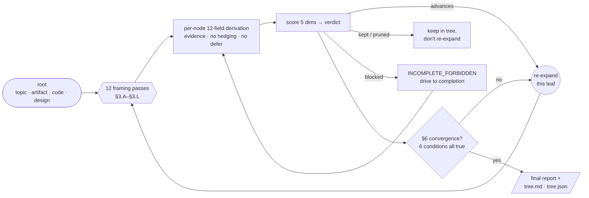
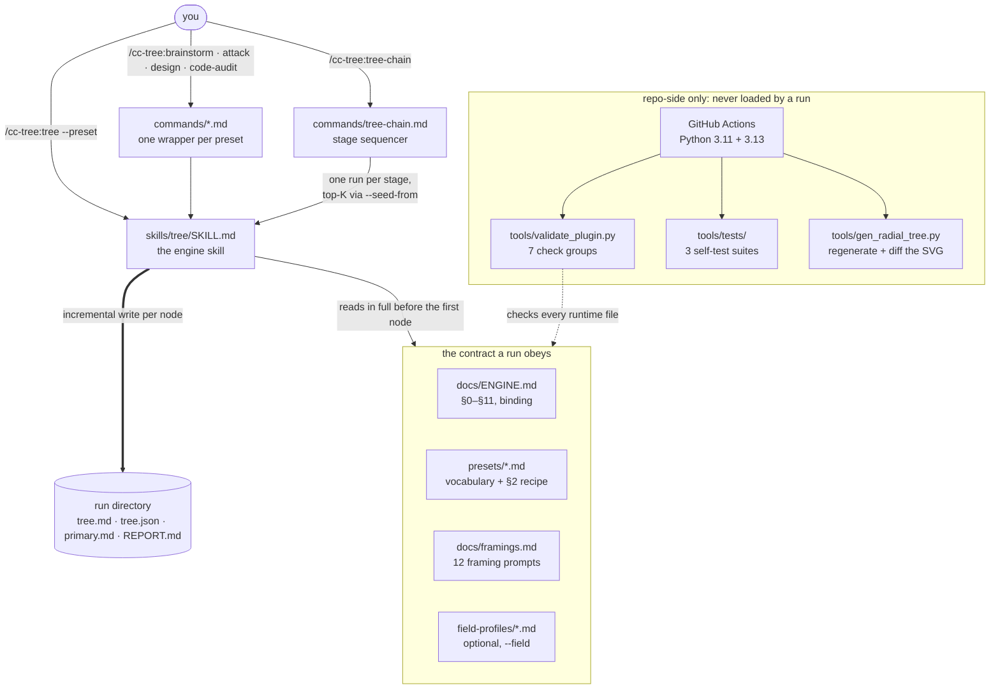

# cc-tree

[](https://github.com/skymanbp/cc-tree/actions/workflows/ci.yml)
[](https://github.com/skymanbp/cc-tree/releases)
[](LICENSE)

[](https://github.com/skymanbp/cc-tree/stargazers)

> 语言：中文。英文规范版：[`README.md`](README.md)。如有歧义，以英文版为准。
<!-- i18n-source-sha256: cea07fa604f27fd88b0109379df67649cfe61a4f01c6289c22a3c7ea053fb608 -->

**cc-tree 是一个 Claude Code 插件，它把开放式思考变成一棵可以被审计的树。**
一台探索引擎，四个 preset —— 头脑风暴、对抗式批评、设计空间探索、代码审计。每个节点都带着
`file:line` 或 URL 证据被完整推导，推脱式叶子（`defer / future-work / TODO / NEEDS-MORE-INFO`）
被禁止，运行按实质性收敛终止，而不是按节点预算。

```bash
claude plugin marketplace add skymanbp/cc-tree
claude plugin install cc-tree@cc-tree
```

## 1 · 问题，以及 cc-tree 对它做了什么

### 1.1 它针对的问题

让 LLM *头脑风暴一下*、*批判性地评审这个*、*对比这几个设计* 或 *审一下这个文件*，回来的总是同样
五种失效模式：

| 失效模式 | 它长什么样 |
|---|---|
| **覆盖太浅** | 那三个最显而易见的角度，然后一段总结 |
| **推脱式叶子** | "有前景，需要更深入的调研 —— 留待未来工作" |
| **伪发散** | 六条分支，其实是同一条分支换了几个名词 |
| **省事式收敛** | "差不多就这些了"，恰好在新想法开始变贵的时候 |
| **无法核验的产物** | 一段聊天记录：没有一句引到行号，翻上去就什么都不剩 |

cc-tree 把每一行反过来：宽度固定的覆盖、零推脱、合并重复、一个你能复核的收敛判据，
每条断言背后都有 `file:line` 或 URL。

### 1.2 它能做什么 —— 五项能力

| # | 能力 | 调用 | 产出 |
|---|---|---|---|
| **1** | **发散探索** —— 研究方向或解题路径，一直长到不再出现高价值新分支 | `/cc-tree:brainstorm` | `shortlist.md` |
| **2** | **对抗式批评** 一份文档、论证或提案；每片叶子都是 `CONFIRMED` / `MARGINAL` / `REFUTED`，并附上工件自己已有的辩护 | `/cc-tree:attack` | `confirmed.md` |
| **3** | **设计空间探索** —— 方案 × 取舍 × 可逆性 × 代价，最后给出 `RECOMMENDED` 短名单 | `/cc-tree:design` | `options.md` |
| **4** | **代码审计** —— linter 看不到的威胁模型、契约与跨文件缺陷，每条都带 `file:line` 和修复建议 | `/cc-tree:code-audit` | `findings.md` |
| **5** | **串联** —— brainstorm → design → attack，阶段之间传递 top-K | `/cc-tree:tree-chain` | 各阶段产物 + 交接日志 |

五项是同一台引擎；preset 只换词汇，从不换循环（[`docs/ENGINE.md`](docs/ENGINE.md) §10）。

### 1.3 工作范围 —— cc-tree 不是什么

- **不是一次性工具，也不是聊天。** 一次运行是递归的，要几分钟到几小时；§2.0 术语拷问之后，
  它一路跑到收敛，中途不再追问（§F6）。你用 flag 来操舵。
- **不能替代领域专家，也不捆绑模型。** 它是跑在你的 Claude Code 模型设置之上的提示词工程；
  该行动哪些叶子，由人来决定。
- **不是 linter。** `code-audit` 找的正是静态分析在结构上找不到的东西。

## 2 · 它是怎么运转的

### 2.1 形状 —— 一个根，向外生长

一次运行就是从一个根（你的输入）向外长出的一棵树。每次展开都要试遍 12 个 framing，所以一个
长出孩子的节点每个 framing 得到一个子节点；每个子节点都被推导、打分，只有 `advances` 的子节点
会被再次展开，于是各分支停在不同的深度。运行在 §6 收敛时结束。


<sub><strong>root</strong> 是输入；<strong>node</strong> 是一个想法、批评、方案或发现；
<strong>depth</strong> 是节点所在的那一圈；<strong>width</strong> 数的是终端叶子，从不计入
<code>blocked</code>（§0.1）；<strong>n</strong> 数的是全部节点。图中是一个 preset 的一次运行 ——
四个 preset 的区别只在树下那张表里的判决用词（§5.2）。图的源码：
<a href="tools/gen_radial_tree.py"><code>tools/gen_radial_tree.py</code></a>，它拒绝画出引擎
不可能产生的树。</sub>

### 2.2 五个不可再分的步骤

五步全部写在 [`docs/ENGINE.md`](docs/ENGINE.md) 里，并且对每一个 preset 都有约束力。


```mermaid
flowchart LR
    R([root<br/>topic · artifact · code · design]) --> F{{12 framing passes<br/>§3.A–§3.L}}
    F --> D[per-node 12-field derivation<br/>evidence · no hedging · no defer]
    D --> S[score 5 dims → verdict]
    S -->|advances| RE((re-expand<br/>this leaf))
    RE --> F
    S -->|kept / pruned| K[keep in tree,<br/>don't re-expand]
    S -->|blocked| B[INCOMPLETE_FORBIDDEN<br/>drive to completion]
    B --> D
    S --> C{§6 convergence?<br/>6 conditions all true}
    C -->|no| RE
    C -->|yes| OUT[/final report +<br/>tree.md · tree.json/]
```

1. **立根（§2）。** 由 preset 的 recipe 构建，每个字段都带引用；可选的术语拷问（§2.0）先把你项目
   的术语钉住。
2. **用 12 个 framing 展开（§3）。** 第一性原理、反转、跨学科、red team、约束变换、尺度外推、
   替换、office-hours 6 问、反共识、失败驱动、高风险非对称、元层面自审 —— 集合固定，让人不舒服
   的角度跳不过去。除非加了 `--no-online`，每个节点还要做一次 §3.X 外部交叉核查。提示词见
   [`docs/framings.md`](docs/framings.md)。
3. **每个子节点推导成 12 个字段（§4）。** 空白、含糊或推脱的字段会让节点成为
   `INCOMPLETE_FORBIDDEN`，在补完之前阻塞终止。
4. **打分并决定（§5）。** 五个维度，每维 0–3：`≥ 11` → `advances`（再展开），`8–10` → `kept`，
   `≤ 7` → `pruned`，未经验证 → `blocked`。余弦相似度 ≥ 0.85 的兄弟节点合并。
5. **只在收敛时停下（§6）。** 六个条件同时成立：没有未完成节点、`advances` 比例低于
   `--min-novelty-ratio`、12 个 framing 全部触发过、每片 `advances` 叶子都再展开到穷尽、存在一条
   §3.K 高风险分支、没有触发任何上限。撞上限会如实报告为 `WIDTH_CAP_REACHED` /
   `DEPTH_CAP_REACHED` / `ROUNDS_EXHAUSTED`，绝不谎称 `CONVERGED`。

### 2.3 八道质量关卡

违反其中任何一道，该轮作废（§0.5）；每一道都对应 §1.1 里的一种失效模式。

| 关卡 | 禁止 | 杀掉 |
|---|---|---|
| §F1 | 凭记忆断言 —— 必须在同一轮内验证 | 无法核验的产物 |
| §F2 | 换词造出的兄弟节点 —— 合并 | 伪发散 |
| §F3 | "显然" / "细节从略" 式推导 | 覆盖太浅 |
| §F4 | 一轮 framing 里没有一条完整推导的高风险分支 | 覆盖太浅 |
| §F5 | 把"没新想法了"冒充收敛 | 省事式收敛 |
| §F6 | 运行中途追问 | 省事式收敛 |
| §F7 | 引擎擅自收窄上限 | 省事式收敛 |
| §F8 | `defer / future work / TODO / 待定 / NEEDS-MORE-INFO` 式叶子 | 推脱式叶子 |

为什么是一台引擎加 preset 而不是四个技能、为什么是 12 个 framing、它和学术界的
Tree-of-Thoughts 有何不同：[`docs/EVALUATION.md`](docs/EVALUATION.md)。

## 3 · 一次运行到底产出什么

取自本仓库的展示样例 [`examples/attack/`](examples/attack/README.md) —— 一次真实的加上限运行
（`--width 3 --depth 1 --no-online --no-grill`），裁剪到只剩 `CONFIRMED` 叶子：

```
BEFORE — examples/attack/sample-claim.md
  3. Therefore the API is 10× faster for all users in production.
  4. The cache never returns stale data, because entries expire after 60 seconds.
  5. We tested with one concurrent user and saw no errors, so the cache is production-ready.

AFTER  — /cc-tree:attack ./sample-claim.md  →  confirmed.md, 3 findings
  C1  §3.F scale extrapolation  score 13  "10× for all users" generalizes a p50
                                          measured on one dev laptop
  C2  §3.A first-principles     score 12  "never stale" is refuted by the 60 s TTL
                                          in the same sentence
  C3  §3.D red team             score 11  "production-ready" rests on a
                                          single-concurrent-user test
```

[`confirmed.md`](examples/attack/expected-out/confirmed.md) 里每条发现都带着引用的原文位置、证据、
工件自己的辩护（`artifact_defense` —— 引擎必须先去找工件自己的反驳，发现才能拿高分）和修复建议；
每个节点的 12 个字段在 [`tree.md`](examples/attack/expected-out/tree.md)。

一次运行写入它的 `--out` 目录 —— 默认是 `tree-out/`，preset 命令是 `<preset>-out/`，串联是
`chain-out/`，各带一段 `<UTCdate>__<slug>/`，全部默认被 `.gitignore`：

```
<out>/
├── tree.md              # every node; the human view
├── tree.json            # every node; the source of truth
├── glossary-anchors.md  # §2.0 prelude output (unless --no-grill)
├── <primary>.md         # shortlist.md / confirmed.md / options.md / findings.md
├── <secondary>.md*      # marginal.md / refuted.md / pending.md / …
├── REPORT.md            # §7.4 final report (also echoed to the terminal)
└── nodes/<id>.md        # spilled when a node's evidence exceeds 100 lines
```

每个节点在 12 个字段填满的那一刻就落盘（§7.1）；用同一个 `--out` 重新调用，就从最后一个完成的
节点继续。

## 4 · 验证

cc-tree 不附带任何延迟或准确率基准：回答质量属于你的模型。它衡量的是引擎规范、运行时提示词、
各 preset、各命令、示例和两种语言的文档是否仍然彼此一致 —— 而负责检查这件事的程序本身也被测试过
会失败。

`tools/validate_plugin.py` 跑七组检查（manifests、skills、presets、commands、tools、cross-refs、
i18n），背后有三套自测，外加一步重新生成示意图并做 diff。CI 在 Python 3.11 和 3.13 上、对每个
pull request 和每次推到 `main` 的 push，按下面的顺序跑这五步。HEAD 快照，2026-10-02；计数随语料
变化，只报告、不断言：

```
$ python tools/validate_plugin.py
  [ok] manifests OK (version 0.7.4, metadata paired, changelog present)
  [ok] skills OK (1 skills)
  [ok] presets OK (4 presets, frontmatter schema)
  [ok] commands OK (5 commands, 4 preset wrappers)
  [ok] tools/**/*.py syntax OK (8 files)
  [ok] cross-refs OK (225 links / 13 anchors, 9 example citations, 47 command flags, 1 field profiles, 395 section refs)
  [ok] i18n OK (8 pairs, 23 canonical-only docs, 146 aligned sections, 492 machine-token checks)
validate_plugin: all checks passed

$ python tools/tests/test_validate.py
test_validate: all schema tests passed (4 shipped presets + 7 positive + 24 negative + 20 parser cases)

$ python tools/tests/test_i18n.py
test_i18n: all 43 multilingual cases passed

$ python tools/tests/test_checks.py
test_checks: all check-group tests passed (8 clean + 43 rejection cases)

$ cp docs/assets/cc-tree-radial-tree.svg /tmp/committed.svg
$ python tools/gen_radial_tree.py
wrote <repo>/docs/assets/cc-tree-radial-tree.svg
tips = 45 width = 45 n = 49 max depth = 3
$ diff -u /tmp/committed.svg docs/assets/cc-tree-radial-tree.svg
```

`diff` 什么都不打印就是通过；`<repo>` 代表 checkout 的根目录。六次全语料对抗式扫查（v0.3.0 到
v0.7.3）把各自查出的每一类漂移都变成了 CI 失败项；它们的方法，以及确认和否决的条数，按版本记在
[`CHANGELOG.md`](CHANGELOG.md)。

## 5 · 安装与快速上手

```bash
claude plugin marketplace add skymanbp/cc-tree
claude plugin install cc-tree@cc-tree
claude plugin validate <path-to-this-repo>   # optional
```

重启 Claude Code 即可加载；之后的版本用 `claude plugin update cc-tree` 获取。

```bash
/cc-tree:brainstorm "ways to detect dark-matter substructure with weak lensing"
/cc-tree:attack ./paper.tex --field physics --lang zh
/cc-tree:design "auth flow for our internal admin tool"
/cc-tree:code-audit ./src/api/upload.py
/cc-tree:tree <root> --preset ./my-custom-preset.md
/cc-tree:brainstorm "topic" --width 20 --depth 2 --no-online   # a capped taste, not convergence
```

## 6 · 参考

### 6.1 Preset —— 自带 4 个，自定义不限

| Preset | 什么时候用 | 根 | 判决（advances / kept / pruned / blocked） | 主产物 |
|---|---|---|---|---|
| `brainstorm` | 发散式构思 | topic | `PROMISING / MARGINAL / DEAD-END / NEEDS-MORE-INFO` | `shortlist.md` |
| `attack` | 批评一份成稿工件 | artifact | `CONFIRMED / MARGINAL / REFUTED / INCOMPLETE_FORBIDDEN` | `confirmed.md` |
| `design` | 方案 × 取舍 × 可逆性 | design-prompt | `RECOMMENDED / VIABLE / NOT-RECOMMENDED / NEEDS-MORE-INFO` | `options.md` |
| `code-audit` | 安全 / 性能 / 正确性 / 契约评审 | code | `CONFIRMED / MARGINAL / REFUTED / INCOMPLETE_FORBIDDEN` | `findings.md` |

自定义 preset 就是一份带 frontmatter schema 的 `.md`，schema 由 CI 检查：
[`docs/presets.md`](docs/presets.md)。任何 preset 都不能削弱通用规则（§10）。

### 6.2 命令

| 命令 | 等价于 |
|---|---|
| `/cc-tree:tree <root> --preset <name\|path>` | 引擎本身；唯一接受自定义 preset 路径的命令 |
| `/cc-tree:brainstorm <topic>` | `/cc-tree:tree <topic> --preset brainstorm` |
| `/cc-tree:attack <file>` | `/cc-tree:tree <file> --preset attack`（另有 `--focus`） |
| `/cc-tree:design <prompt\|file>` | `/cc-tree:tree <prompt> --preset design` |
| `/cc-tree:code-audit <path>` | `/cc-tree:tree <path> --preset code-audit` |
| `/cc-tree:tree-chain <root> --stages …` | 多个 preset 依次跑，阶段之间传递 top-K |

### 6.3 Flag

权威表格在 [`skills/tree/SKILL.md`](skills/tree/SKILL.md)。

| Flag | 默认 | 含义 |
|---|---|---|
| `--preset <name\|path>` | *必填* | 自带 preset，或你自己的路径 |
| `--lang <tag\|auto>` | `en` | 散文的语言；机器 token 保持英文 |
| `--width N` / `--depth N` / `--rounds N` | ∞ / ∞ / `conv` | 上限；撞上限会如实报告，绝不算作收敛 |
| `--max-branches N` | ∞ | 每节点每轮的新分支数；下限 12 |
| `--out <dir>` | 按命令而定 | 运行目录 |
| `--glossary <path>` | 按 preset 而定 | §2.0 术语拷问用的术语表 |
| `--field <name\|path>` | 无 | 领域加权用的 field profile |
| `--seed-from <primary.md>` | 无 | 用上一轮的产物给 depth 1 播种（别名 `--from-prior`） |
| `--no-grill` / `--no-online` | 关 | 跳过 §2.0 术语拷问 / 外部交叉核查 |
| `--min-frameworks N` | 12 | 每节点 framing 数；下限 12 |
| `--min-novelty-ratio R` | 0.15 | §6.1 里 `advances` 比例的阈值 |

`tree-chain` 另有 `--stages <a,b,c>`（默认 `brainstorm,design,attack`）和 `--top-k N`（默认 3）。

### 6.4 领域档案、串联、语言

- **领域档案。** `--field <name|path>` 加载四份简短清单 —— 审稿人关注点、领域共识、常见失效
  模式、证据门槛 —— 用来重排先探索哪些分支，并抬高引用标准（§2.2）。自带 `physics`；其他的从
  [`field-profiles/_template.md`](field-profiles/_template.md) 开始写。
- **串联。** `/cc-tree:tree-chain "…" --stages brainstorm,design,attack --top-k 3` 让每个阶段各自
  跑到收敛，并记录每一次 top-K 交接；`--seed-from` 可以手工做同样的事。契约见
  [`docs/chaining.md`](docs/chaining.md)。
- **语言。** `--lang` 本地化散文（`auto` 检测根的语言，认不出就回退到 `en`）；flag、键名、判决
  标签、状态、文件名与路径保持英文（§1.0）。文档守同一条规则：`X.md` 是规范版，`X.zh.md` 是
  中文平行版，英文源变了而译文没跟上，CI 就失败。

## 7 · 设计取舍

cc-tree 是一个提示词工程工件：运行时是 Markdown，而 Python（只用标准库，任何一次运行都不加载它）
的存在只是为了让这些 Markdown 保持诚实。完整论证在 [`docs/EVALUATION.md`](docs/EVALUATION.md)。

- **一台引擎 + 可替换 preset**，而不是四个近乎重复的技能，也不是一个带 `--mode` 的巨型技能。
- **上限默认为 ∞**，这样就不能在一个随意的数目上宣布成功。
- **推脱式叶子是硬禁**：一条分支要么现在就推进到可评估，要么改道（§3.E）。
- **增量写盘**：这棵树能挺过进程被杀、上下文溢出或一个 `^C`。
- **英文规范的机器骨架**：散文本地化，标识符不动。
- **结构校验，而非语义校验**：CI 检查语料自洽；一套打分标尺*好不好*仍是人的判断。

## 8 · 仓库地图与文档索引

### 8.1 架构

运行时是你敲下命令时由 Claude Code 加载的 Markdown；验证侧是只有 CI 和贡献者会跑的 Python。


```mermaid
flowchart TB
    U(["you"])
    U -->|"/cc-tree:brainstorm · attack · design · code-audit"| CMD["commands/*.md<br/>one wrapper per preset"]
    U -->|"/cc-tree:tree --preset"| SK
    U -->|"/cc-tree:tree-chain"| CH["commands/tree-chain.md<br/>stage sequencer"]
    CMD --> SK["skills/tree/SKILL.md<br/>the engine skill"]
    CH -->|"one run per stage,<br/>top-K via --seed-from"| SK
    SK -->|"reads in full before the first node"| LOAD
    subgraph LOAD ["the contract a run obeys"]
        direction LR
        EN["docs/ENGINE.md<br/>§0–§11, binding"]
        PR["presets/*.md<br/>vocabulary + §2 recipe"]
        FR["docs/framings.md<br/>12 framing prompts"]
        FP["field-profiles/*.md<br/>optional, --field"]
    end
    SK ==>|"incremental write per node"| OUT[("run directory<br/>tree.md · tree.json · primary.md · REPORT.md")]
    subgraph VERIFY ["repo-side only: never loaded by a run"]
        direction LR
        CI["GitHub Actions<br/>Python 3.11 + 3.13"] --> VP["tools/validate_plugin.py<br/>7 check groups"]
        CI --> TS["tools/tests/<br/>3 self-test suites"]
        CI --> GEN["tools/gen_radial_tree.py<br/>regenerate + diff the SVG"]
    end
    VP -.->|"checks every runtime file"| LOAD
```

### 8.2 文档索引

从 [`docs/README.md`](docs/README.md) 这份带注索引开始。

| 文档 | 什么时候读它 |
|---|---|
| [`docs/ENGINE.md`](docs/ENGINE.md) | 你想要有约束力的契约，§0–§11 |
| [`docs/framings.md`](docs/framings.md) | 你想要 12 个 framing 提示词 |
| [`docs/presets.md`](docs/presets.md) | 你要写一个 preset |
| [`docs/chaining.md`](docs/chaining.md) | 你要把多个 preset 串起来 |
| [`field-profiles/README.md`](field-profiles/README.md) | 你要写一个领域档案 |
| [`examples/attack/README.md`](examples/attack/README.md) | 你想看真实的输入与产物 |
| [`docs/EVALUATION.md`](docs/EVALUATION.md) | 你想要设计理据 |
| [`CONTRIBUTING.md`](CONTRIBUTING.md) | 你准备提一个 pull request |
| [`CHANGELOG.md`](CHANGELOG.md) | 你想要逐版本的历史 |

## 9 · 路线图、已知限制及其余

### 9.1 路线图

下面这些仍然开着，都没有排日期：对打分标尺做语义校验（理由见
[`docs/EVALUATION.md`](docs/EVALUATION.md)）；再多几个自带的 preset
（[#1](https://github.com/skymanbp/cc-tree/issues/1)）；再多几份领域档案
（[#2](https://github.com/skymanbp/cc-tree/issues/2)）；把 `tree.json` 导出成图
（[#3](https://github.com/skymanbp/cc-tree/issues/3)）；一个收录真实运行结果的展廊
（[#4](https://github.com/skymanbp/cc-tree/issues/4)）；长时间运行时的进度提示与续跑报告
（[#5](https://github.com/skymanbp/cc-tree/issues/5)）；以及更多的文档语言。

### 9.2 已知限制

- **没有产物基准**（§4）：质量跟着你的模型走；这个仓库量的是它自己的自洽性。
- **CI 校验的是仓库，不是一次运行。** 运行内的合规靠 §11 审计清单和 §7.4 报告里的自审。
- **默认无上限。** 对内容丰富的根做无上限运行，可能要几个小时、烧掉大量 token；第一遍先设上限。
- **译文新鲜度被强制，译文质量不被强制。**
- **`--no-online` 会把证据收窄**到本地来源；运行仍然有效。
- **子代理扇出买到的是墙钟时间，不是 token**：主代理要重新核对子代理返回的每一条引用（§8.1）。

### 9.3 与 sci-paper 的关系、参与贡献、许可

cc-tree 是 [`skymanbp/sci-paper`](https://github.com/skymanbp/sci-paper) 里 `brainstorm` +
`paper-attack-tree` 技能的领域无关抽取版；两者各自演进。欢迎 pull request ——
[`CONTRIBUTING.md`](CONTRIBUTING.md) 列出了在本地复现 CI 的命令，以及新贡献者最容易绊倒的那些
不变式。[MIT](LICENSE)；运行产物目录属于你，默认被 `.gitignore` 掉。
